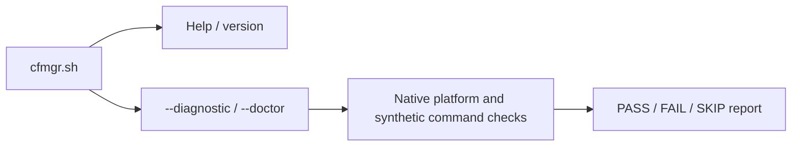

# 🧩 Architecture

[← README](../README.md) · [Development](development.md) · [Compatibility](compatibility.md) · [Implementation plan](../PLAN.md)

This is a working developer guide. It separates implemented foundations from
the intended manager; [PLAN.md](../PLAN.md) owns the detailed contracts,
acceptance checklist and implementation record. The full documentation polish
follows implementation and validation.

## 🧱 Current implementation

The repository entry point is `cfmgr.sh`; its runtime helpers live in `modules/`.
POSIX shell sources the shell helpers and invokes the awk parsers directly.
There is no generated or compiled main script. The planned installed command
remains `cfmgr`.

The development entry supports help, version and the two equivalent health
commands. It does not install CFMgr or start a feature.

| Module | Implemented responsibility | Boundary |
| --- | --- | --- |
| `cfmgr.sh` | Development command dispatch and bounded module-path resolution | No operational startup or repair |
| `modules/diagnostic.sh` | Native health report, private synthetic probes and cleanup | Entware execution and full runtime inventory remain incomplete |
| `modules/common.sh` | Decimal/range/version/SHA-256 text validation | No filesystem, service or network work |
| `modules/json.awk` | Strict bounded JSON validation and token framing | Caller must acquire stable input and validate complete output |
| `modules/ip.sh` | Strict IPv4/IPv6 host normalization | Address syntax does not establish public eligibility or current WAN state |
| `modules/mountinfo.awk` | Select a covering mount; optionally report propagation and descendant counts | Snapshot facts do not establish persistent volume identity, writability or live mount stability |
| `modules/io.sh` | Private bounded captures, checked mount/topology snapshots and publication after cleanup | Internal library; volume approval and command supervision remain separate |
| `modules/storageinfo.awk` | Parse mount-ID, block-device and primary-superblock observations | Strict observation formats; label-bearing blkid reports cannot establish UUID identity |
| `modules/storage.sh` | Compare mount/device facts and read an ext UUID; optionally retain the original descriptors through a trusted callback | Observation does not grant write permission; no dependency execution or CLI integration |
| `modules/isolation.sh` | Own a private RAM root, verify native or fixed-probe mounts and remove them before deleting staging | Separate synchronous native and admitted fixed-probe APIs; no operational CLI |
| `modules/supervision.sh` | Bound fixed-probe startup polling and validate private terminal/capture records | Used by the fixed-probe lifecycle; admitted executable closure and explicit completion remain mandatory |
| `modules/closure.sh` | Stage a bounded fixed library/tool image and verify private copies against the supplied manifest | Copy/integrity only; caller must first bound manifest acquisition and independently approve provenance and ELF graph before execution |
| `modules/bootstrap.sh` | Select reviewed identities, construct a bounded member manifest and materialize both fixed bootstrap tools | Requires trusted helpers and private RAM; no automatic profile selection or operational launch |
| `modules/fetch.sh` | Acquire one reviewed bootstrap archive through native HTTPS curl and verify its private bytes | Physical output caps, exact status/size/hash; no redirect, extraction, package execution or CLI wiring |
| `modules/archive.sh` | Copy and verify a reviewed bootstrap archive, then extract its fixed member through bounded native stdout stages | Every parser input is an approved private copy; no archive path restoration, executable mode, package execution or generic archive support |

The parsing modules are tested foundations, not yet a complete operational call
path. See [development checks](development.md#-run-checks) for reproducible host
validation and the separate BusyBox evidence requirement.

## 🗂️ Storage and authority

| Location | Intended responsibility |
| --- | --- |
| `/jffs/scripts/cfmgr` | Installed public entry point |
| `/jffs/addons/CFMgr.d/` | Verified manager modules, private configuration and bounded durable recovery |
| `/jffs/addons/CFMgr.d/config` | Authoritative settings, typed credentials, saved activation and module catalog |
| Private RAM workspace | Transient requests, queues, observations, captures and staging |
| Verified Entware volume | Selected packages, cloudflared binary, tunnel runtime files and optional custom logs |
| User-selected backup drive | Manual data-only archives under `CFBackup/` |

Persistent settings and recovery stay in JFFS; frequent observations and retry
state stay in RAM. Missing storage must preserve saved intent and report waiting
or incomplete work. A mount label, `/dev/sd` name, directory or executable alone
cannot establish the expected volume.

The storage observer joins the held directory's mount ID to the current mount
table, checks the block device number and reads the primary ext superblock through
the original open descriptor. It repeats the path/mount/device checks before
staging its result. The descriptors remain open through observation and staging;
the private workspace is cleaned before the result is published.

The internal `cfmgr_storage_with` API instead runs a trusted callback after all
checks, passing the resolved directory, complete volume ledger and caller
arguments while both descriptors remain held. It returns status without
publishing callback output. The callback owns any external transaction guard
and cleanup; mounted trees and asynchronous users must stay outside IO scratch.
Ordinary return restores the caller's descriptors before cleanup. A signal-driven
exit may retain them until process exit, so interrupted setup must preserve its
external guard.

The internal `cfmgr_isolation_with` API builds on that retained callback. It
reserves a private guard outside IO scratch, checks the RAM/source topology,
then binds `/dev/null` and the held Entware directory into its own root. A
trusted synchronous callback receives the root, complete volume ledger and
unchanged arguments only after both mounts pass verification.

Cleanup checks each recorded mount again, removes Opt before null, and proves
both absent before deleting the guard. Busy, changed or uncertain mounts and
interrupted operations leave the guard for recovery. Existing guards are never
adopted or removed automatically. The native callback API does not launch a process inside the root. A separate
internal fixed-probe entry connects image staging and supervision as described
below; neither entry exposes an operational CLI action.

This first profile covers dynamic-revision ext2/ext3/ext4 primary superblocks.
Other filesystems, alternate `sb=` mounts and missing mount-ID support need
separate profiles. A matching observation does not prove writability, filesystem
health or uninterrupted device identity, and it cannot authorize a later write
through a freshly resolved path.

Backups contain configuration and inventoried data, including credentials; they
do not restore executable code or live process/queue/transaction state. The
current manager validates a restore and rebuilds its own integrations.

## ⚙️ Intended execution boundaries

The runtime language is BusyBox-compatible POSIX `sh`. Python, pytest and the
virtualenv are developer tools only. Shared operational prerequisites are `jq`,
`coreutils-timeout` and `coreutils-sha256sum`; scoped DNS/locking additions follow
the [compatibility policy](compatibility.md). Native recovery and health checks
must remain available when those packages cannot run.

| Boundary | Required behavior |
| --- | --- |
| Entry and hooks | Validate the action, apply guards and admit bounded work; no menu or unbounded wait from a firmware hook |
| Shared controller | Check current configuration, prerequisites, ownership and retry eligibility before starting work |
| DDNS and IP-Sync | Share current IPv4/IPv6 observations, retain independent outcomes and reconcile only configured targets |
| Cloudflared controller | Keep saved activation, binary maintenance, readiness and owned-process recovery distinct |
| Installer and updater | Verify the selected generation and complete staged artifacts before replacement; retain recoverable failures |
| Status and health | Report evidence without starting services, installing dependencies or contacting providers |

The DDNS hook is the explicit bounded-wait exception so it can report Merlin's
success/failure result. It must defer promptly during boot or missing readiness.
Only a failed or timed-out firmware DDNS attempt schedules the additional CFMgr
retry; successful completion does not schedule a forced update. Exact boot
release, overlap handling and the whole-action deadline remain implementation
gates.

Why checking a command or mount once is insufficient

An installed-package record does not prove that its executable loads, supports
the required arguments or still belongs to the expected mounted volume. A
successful parser exit does not prove its output was written completely. A
live process does not prove tunnel connectivity.

The intended controller checks the evidence appropriate to each boundary and
preserves unknown outcomes. Dependency installation, operational mount-loss handling and general command
supervision still need implementation and fault-path validation. The fixed-probe
helpers have a narrower contract and do not establish those guarantees.

🔒 Dependency execution: selected implementation direction

Entware's loader reads absolute `/opt` paths before a program starts. An
explicit loader path alone therefore cannot contain execution when the public
mount path changes. The fixed-probe profile uses native bind mounts and chroot
to separate verified executable bytes from the mutable installation destination.
A small private RAM image provides the admitted programs, loader and libraries
at `/opt`, with a verified read-only bind and no preload file. Later restricted
installation would expose the retained Entware directory separately at
`/offline/opt`. Version probes do not mount the mutable Entware directory
inside their root. Artifact provenance and ELF-graph admission remain caller
prerequisites; accepting supplied hashes does not establish trust. Before calling
the internal probe entry, the owner must construct/acquire the approved manifest
within 4096 original bytes in stable private RAM. Staging validates its length
after reading through EOF, so that check is not a bounded acquisition primitive.

The bootstrap manifest helper supplies one approved construction route. Its
three fixed profiles contain the reviewed sizes and SHA256 identities of the
loader, libraries, timeout and gzip. It writes only those compiled-in rows to a
fresh private file, then checks the complete bytes through the existing manifest
consumer. The [bootstrap catalogue](evidence/bootstrap-catalog.json) records
which official index and archive supplied each member, together with its reviewed
ELF dependencies and links. Staging must still hash each actual private copy;
arbitrary caller-supplied digests do not acquire trust from the helper.

These identities describe a reviewed bootstrap snapshot, not a package-manager
version preference. Changed bytes require a reviewed catalogue/code update;
unknown base libraries fail closed without a downgrade or automatic repair.
Recorded HTTPS provenance and hashes do not claim signed-index verification,
reproducible builds or hardware compatibility. Profile selection, saved-volume
authority enrollment, general archive handling and operational wiring remain
separate requirements.

`cfmgr_bootstrap_fetch` uses the same catalogue to select only the reviewed
timeout or gzip archive for a fixed profile. Native curl receives an isolated
configuration/environment and one HTTPS URL, with no redirects or retries.
The fresh private RAM directory retains partial results on failure. Shell file
limits bound the body, headers and status files independently of server size
claims; acceptance then requires the exact reviewed body size and SHA256,
bounded headers and the complete three-byte HTTP status `200`. Nothing in this
helper extracts or executes the acquired bytes. Its caller still owns signals,
resource lifetime and the total action budget; curl timeouts do not establish a
hard kernel or DNS deadline.

`cfmgr_bootstrap_extract` first makes a bounded private copy of that archive
and checks its reviewed size and hash. It then uses separate native gunzip and
plain tar commands, verifying the complete intermediate bytes before the next
parser runs. Tar writes only the fixed timeout or gzip member to stdout; it
never restores archive paths, permissions or ownership. The resulting `program`
is mode 0600 data, ready for the existing image-staging checks. Per-stage file
limits keep even partial outputs below one MiB in aggregate. Failure retains
those private files for the owning caller's cleanup decision. This route is
limited to the reviewed archive bytes and layout; it does not validate arbitrary
backups or install packages.

`cfmgr_bootstrap_materialize` joins those two consumers for the fixed timeout
and gzip packages. It creates fresh download/extraction subdirectories and stops
at the first failure. The isolated native preparation process uses cwd `/`,
stdin `/dev/null` and closed FD3–9, keeping retained storage descriptors out of
the downloader and extractor. Successful outputs remain private data until
image staging verifies and assigns their executable modes.

The internal `cfmgr_isolation_bootstrap` entry connects that catalogue route to
the retained storage owner. Its caller supplies an independently approved UUID
and filesystem-relative Entware subtree, encoded as the storage ledger's byte
hex. Both must match the freshly validated ledger before a guard is reserved.
This prevents a different subtree on the same volume from acquiring approval
merely because its UUID matches. The owner then admits its private RAM topology,
constructs `bootstrap-manifest.tsv` inside its new guard and stages against those
fixed hashes before any bind or probe. The separate `cfmgr_isolation_acquire`
entry takes the same authority and profile but obtains both program files through
the fixed materialization route instead of accepting supplied program paths.

Every isolation mode marks private preparation active before creating the tree
and its metadata. Probe modes also cover acquisition, manifest construction,
image copying and source-topology verification with that marker. Complete
preparation clears it immediately before the first bind.

Acquisition has a separate internal completion result. Its native commands run
sequentially, and every nested helper must distinguish a deliberately completed
failure from an interruption or unexpected shell exit. Only that internal proof
allows an acquisition failure to clear the marker. Existing cleanup then checks
the private RAM directory and its unchanged mount identity before removing
partial downloads, allowing a fresh attempt. Public helper failure codes do not
provide this proof. Successful acquisition keeps preparation protected while
image staging continues.

Uncertain acquisition and failures during later image/root preparation retain
the guard and partial files. A generic nonzero shell status or unchanged mount
topology cannot prove that an interrupted inner shell left no producer alive.
This completion contract depends on the reviewed native tools running
synchronously without background descendants. Recovery of uncertain retained
attempts and aggregate worker deadlines remain unfinished requirements.

This entry accepts no caller manifest or hash. The lower-level supplied-manifest
probe remains available to already trusted internal callers and explicit fixture
proofs under its original admission preconditions. These APIs do not select a profile
from firmware/kernel strings, approve a volume from its own current observation,
or grant a general storage write lease. Saved-authority enrollment and actual
Entware execution remain separate acceptance work.

The existing native profile binds the expected Entware directory and `/dev/null`.
The outer native owner checks mount identity and removes its
exact mounts before deleting staging. Uncertain cleanup retains a guard and
workspace for recovery. The initial native ownership and cleanup code is in
`modules/isolation.sh`. Focused host fixtures cover its fault matrix; the separate
[Linux kernel lane](development.md#isolated-linux-kernel-checks) exercises actual
mounts, busy cleanup, interruption and controlled static/dynamic executable
mapping behavior. Its namespaces and compiler are developer tools only. The
[plan](../PLAN.md#mount-snapshot-parser-contract--current-package) records its
proof gates and the distinction from hostile-root security isolation.

Before any bind, the owner checks the native BusyBox unmount capability using
bounded help output. It selects the older `-D -n` or newer `-n` command while
preserving ordinary unmount and avoiding loop-device and mtab side effects.
Unknown capability stops the attempt before mounts; an actual cleanup failure
never triggers a retry with different flags. Firmware version numbers alone
do not select this behavior.

For contained probes, cleanup uses ordinary unmount's busy check:
admitted executable mappings retain the exact execution-image bind. Native
launcher completion and successful verified unmount are both required before
staging can be removed. A bounded polling helper records completion separately
from exit status; a polling deadline leaves the launcher unproved and the guard
retained. It never signals a saved numeric PID. The separate fixed-probe entry
accepts only the timeout or gzip version probe. It clears the active launcher
only when nothing started or the supervisor validated completion; a returned
failure or deadline alone cannot authorize cleanup. Even a pre-bind staging
failure requires a fresh unchanged/private RAM topology check before removal.
This does not promise complete process reaping or a hard deadline for blocked
kernel IO. Controlled host ELF tests do not expand the native callback's scope
or prove Entware ABI or Merlin runtime acceptance.

## 📦 Modules and forks

Modules remain readable source files. The shipped catalog defaults to `main`;
developers can manually select `develop` or a full commit hash in the main
configuration. Resolve a branch once, then acquire one immutable repository
snapshot with its manifest and hashes. Never combine newer per-file fallbacks
or execute catalog contents as shell code.

The **developer flag** defaults to `false`. When `true`, update/reinstall preserves
an existing catalog and normal manager update checks are suppressed. A missing
catalog may be seeded; malformed settings require repair. The detailed catalog
contract and fork examples are in the [development guide](development.md#-module-catalog-and-forks).

Normal startup and hooks do not fetch missing manager code. Installation and
repair own package acquisition; dependency checks do not authorize arbitrary
module downloads.
