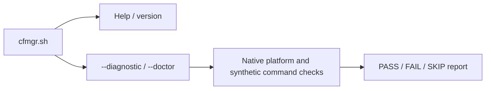

# 🧩 Architecture

[← README](../README.md) · [Development](development.md) · [Compatibility](compatibility.md) · [Implementation plan](../PLAN.md)


This guide describes the source layout and internal interfaces.
[PLAN.md](../PLAN.md) owns detailed design and validation records.

## 🧱 Runtime structure

The repository entry point is `cfmgr.sh`; runtime code is grouped in `modules/`.
POSIX shell sources the shell helpers and invokes the awk parsers directly.
There is no generated or compiled main script. The entry supports help, version
and the two equivalent health commands.

The host-only `tools/package_manifest.py` developer utility inventories raw
Git blobs from one explicit full commit ID and validates its generated manifest
with the trusted parsers in the current tool checkout. It is separate from the
router command path: it does not execute files from the selected commit or
make persistent repository changes, and its output grants no trust,
completeness, acquisition or installation authority.



| Module | Responsibility | Boundary |
| --- | --- | --- |
| `cfmgr.sh` | Command dispatch and bounded module-path resolution | No operational startup or repair |
| `modules/diagnostic.sh` | Native health report, private synthetic probes and cleanup | Does not execute Entware tools or feature operations |
| `modules/lib/common.sh`, `modules/lib/ip.sh`, `modules/lib/json.awk` | Shared text validation, IPv4/IPv6 normalization and scope classification, supplied IPv4 observation report, plus bounded JSON token framing | Libraries/parsers only; no observation collection, feature startup or provider calls |
| `modules/lib/wan.sh` | Supplied selected-WAN policy and native IPv4 source-candidate reports | Pure reports over one caller-acquired basic two-unit Ethernet profile; no collection, identity/freshness, egress check or provider authority |
| `modules/lib/observation.sh` | Supplied boot, generation and source-identity freshness report | Depends on `common.sh`; source-only report checks supplied IDs and monotonic age, without collecting, hashing, caching or authorizing evidence |
| `modules/lib/config_header.awk`, `modules/lib/catalog.awk`, `modules/lib/manifest.awk`, `modules/lib/package_path.awk` | Bounded config header/lifecycle, source-catalog and package-manifest parsing with shared safe-path checks | Source-only functions/parsers; no complete config reader, manifest trust, downloader, writer or package/install authority |
| `modules/lib/json.sh`, `modules/lib/config.sh`, `modules/lib/setup_state.sh` | Fixed JSON-token capture, config-header/lifecycle projection, and supplied setup-state report through the IO owner | Returns saved projection fields only; credential values are not returned, and full settings validation or installed-config admission is outside these APIs |
| `modules/lib/entry_version.awk` | Bounded literal version extraction from immutable entry source data | Does not execute the entry or prove semantic module/API compatibility |
| `modules/lib/package.sh` | Owned native manifest capture, canonical reports, declared-byte verification, manifest-derived tree, entry-version and supplied-policy reports | Source-only APIs require caller-prepared immutable inputs; no source authenticity, semantic compatibility, installation or activation authority |
| `modules/lib/catalog.sh` | Join a parsed catalog projection with a separately supplied manifest into a commit-pinned source plan | Caller owns branch-to-commit correspondence and manifest provenance; no acquisition, authentication, source-byte verification or installation authority |
| `modules/lib/native_digest.sh` | Shared bounded-size and native digest observations used by package verification and executable-closure checks | Caller owns bounded acquisition, scratch, cleanup and signals; no independent source trust or hard deadline |
| `modules/lib/mountinfo.awk`, `modules/lib/storageinfo.awk` | Parse mount, device and primary-superblock observations | Snapshot facts do not establish persistent volume identity, writability or live mount stability |
| `modules/lib/io.sh`, `modules/lib/storage.sh`, `modules/lib/entware.sh` | Bounded captures and retained-storage observation/admission; IO tool resolution includes `rmdir` and bounded captures allow native `find` | Internal callbacks; no operational package execution or CLI integration |
| `modules/lib/dependency_lock.sh`, `modules/lib/isolation.sh` | Cooperative lock and checked native, fixed-probe, read-only execution-root, native-data-root, quota-limited native-tmp-root and retained Entware-root lifecycles | Internal APIs; uncertainty retains guards and no entry exposes an operational CLI |
| `modules/lib/native_config.sh` | Inside an active IO callback, stage opaque `/etc/hosts` and `/etc/resolv.conf`; an extended API adds fixed NSS, wget, OpenSSL config and CA files | Data copies only; no syntax, trust, readiness, execution or broader closure approval; legacy root entries remain two-file |
| `modules/lib/native_config_root.sh` | Select the fixed extended-config composition over the retained-Opt/device root lifecycle | Source-only native observer API; six files staged before bind; no arbitrary payload or package-install wiring |
| `modules/lib/native_exec.sh` | Probe one fixed native shell/BusyBox command or the installed `opkg --version` inside an already checked native-config root | Explicit synchronous callback exceptions; fixed commands only; caller owns the deadline and root authority; no general executable or DNS/TLS admission |
| `modules/helpers/native_probe.sh` | Compose the fixed native shell probe with the existing deadline, retained-storage and checked native-config-root owners | Source-only ten-argument internal API; no CLI, cron installation, operational worker, package installation or network action |
| `modules/helpers/dependencies.sh` | Compose original-shell process-group admission, stable CFMgr locking, aggregate deadline, retained storage, native-config root, fixed dependency backend and checked release | Source-only fourteen-argument API; no CLI, cron installation, readiness/retry flow or router acceptance |
| `modules/lib/entware_root.sh` | Attach an already-admitted Entware directory to the checked native root through held FD9 | Requires independent storage admission and original FD8/FD9; the ledger format alone grants no authority; callback is native-only |
| `modules/lib/native_devices.sh` | Add fixed private-RAM `/dev/null` and `/dev/urandom` nodes to the retained-Opt native root | Only these two root-owned nodes; checked mount views do not lease inode identity continuously or revoke already-open descriptors |
| `modules/lib/supervision.sh`, `modules/lib/closure.sh` | Fixed-probe completion and bounded executable-image staging, using the shared native digest helper | Caller must separately approve provenance and executable closure; these are not a general package runner |
| `modules/helpers/worker.sh` | Native process-group admission and guarded aggregate-deadline supervision | Internal compositions only; operational scheduling and package/feature launch remain separate |
| `modules/helpers/bootstrap.sh` | Install missing dependencies or explicitly reinstall selected direct packages through Entware opkg, then verify them | Internal synchronous backend; admitted mount, serialized worker and hook scheduling remain caller prerequisites; doctor never calls it |

The parsing modules and native reports are internal interfaces; the CLI
exposes help, version and diagnostic commands. See [development checks](development.md#-run-checks) for host validation
commands and the separate BusyBox evidence requirement.

### Source layout and loading

```text
cfmgr.sh                Command dispatch
modules/
├── diagnostic.sh       Native health report
├── helpers/            Dependency bootstrap and supervised worker helpers
└── lib/                Shared shell libraries and awk parsers
tests/                  Host tests and controlled kernel fixtures
tools/                  Developer validation tools
docs/                   Architecture, development and user guidance
```

Feature modules belong directly in `modules/`; shared code belongs in `lib/`,
and supporting workers and dependency setup belong in `helpers/`. Feature
modules use small explicit interfaces and shared libraries.
The entry point resolves and sources the diagnostics module explicitly; the
native configuration, retained-Opt and fixed-device helpers are source-only
internal APIs. There is no automatic loading of arbitrary files or directories.

## 🗂️ Storage and authority

Integration follows Merlin’s official [Addons API](https://github.com/RMerl/asuswrt-merlin.ng/wiki/Addons-API),
[User scripts](https://github.com/RMerl/asuswrt-merlin.ng/wiki/User-scripts) and
[Custom config files](https://github.com/RMerl/asuswrt-merlin.ng/wiki/Custom-config-files)
guidance, checked against the supported firmware source. Revisit affected
conventions when source changes; record
version differences and design decisions in the plan. Firmware configuration
overrides and shared WebUI settings are separate from CFMgr’s private config.

Persistent-storage observations require held descriptors and current mount evidence; a path, label, or executable alone does not establish the expected volume.

The storage observer joins the held directory's mount ID to the current mount
table, checks the block device number and reads the first 1,152 bytes of the
primary ext superblock through the original open descriptor. It repeats the
path/mount/device checks before staging its result. The descriptors remain open
through observation and staging; the private workspace is cleaned before the
result is published.

### Bounded parser and IO contracts

`modules/lib/json.awk` accepts a stable private input up to 64 KiB with a
separately checked byte count, nesting limited to 32 containers, 4,096 value
nodes and 16 KiB per decoded string. Its token ledger is capped at 128 KiB
including the terminal count footer; numeric text is preserved. Consumers set
`LC_ALL=C` and check parser status, exact framing, byte count and sequential
records; this does not establish configuration semantics or authorize a provider
request. `modules/lib/ip.sh`
normalizes IPv4/IPv6 text, including lower-case shortest IPv6 with longest-leftmost
zero compression. `cfmgr_ipv4_classify` accepts one canonical IPv4 address and
returns `global`, `private`, `shared` or `nonpublic` using fixed address ranges.
`cfmgr_ipv6_classify` accepts one address accepted by the IPv6 normalizer and
returns `private`, `transition`, `special`, `nonpublic` or `global` from fixed
range rules. Both classifiers are pure shell helpers with subshell-isolated
caller state; they do not discover interfaces, access the network or read
state.
This is a source-only classification: it does not establish assignment, routing,
WAN ownership, freshness, NAT, reachability or eligibility for publication.
IPv6 normalization remains a separate syntax and canonical-format operation;
the classifier does not detect network-specific NAT64 or assess an embedded
IPv4 address's scope or reachability.

`cfmgr_ipv4_observation_report WAN EXTERNAL` compares two caller-supplied IPv4
values, using `-` for an unavailable observation. It emits a versioned,
newline-terminated tab-separated record and a footer containing the byte count
of that record. Invalid arity or invalid non-`-` input returns status 1 without
output. The helper performs no address collection, route lookup or network or
provider access. `active` is a candidate from the supplied comparison, not
proof of address assignment, freshness or reachability; `unknown` never
authorizes deletion. `nat=false` records matching supplied global addresses
and is not universal proof that no upstream translation exists.

`modules/lib/wan.sh` adds supplied-data selection for firmware modes `off`,
`fo`, `fb` and `lb`, plus basic DHCP/static/PPPoE/PPTP/L2TP interface mapping.
It emits framed selected/unknown policy and candidate/inactive/unknown source
reports; only an explicit administrative enable flag of zero establishes
inactivity. Automatic load-balance selection prefers IANA global addresses,
and ambiguous primary selection fails closed. A connected flag is caller
normalized eligibility from complete evidence, not raw `state_t` or online
status. Collection, source identity, freshness and matching-family egress
verification remain caller prerequisites and are not implemented here.

`modules/lib/observation.sh` checks caller-supplied boot, generation and source
identity pairs before evaluating monotonic age against maximum and optional
finite lifetime caps. A `current/fresh` result establishes only those supplied
relationships. The caller must recompute the source ID for a coherent snapshot,
including family intent and observation kind, then recheck identity and
generation before consumption. Inactive/removal evidence uses the same check.
The helper does not acquire data, verify egress or grant provider authority.

`modules/lib/mountinfo.awk` chooses the deepest mount covering a canonical path
and rejects ambiguous covering ancestors. It consumes a stable snapshot capped
at 64 KiB, 1,024 records, 8,192 bytes per line and a 4,096-byte target. It
calculates the target's path inside the selected filesystem, including bind
mount roots. Standard mountinfo path escapes are decoded; the internal byte-encoded result has a
terminal byte-count footer. Its caller provides `LC_ALL=C`, the independently
checked snapshot byte count and `CFMGR_MOUNT_TARGET` in the environment. Numeric
mount IDs remain exact text. These facts are observations, not persistent
identity or write authority.

`modules/lib/storageinfo.awk` parses stable private native observations with
independently checked byte counts, `LC_ALL=C` and a literal mode. Inputs are at
most 4 KiB (fdinfo up to 64 records), preserving large numeric IDs as text. It
rejects label-bearing `blkid` records because firmware label formatting can
imitate a UUID field. Status `0` is a complete framed result, `1` malformed or
rejected input, `2` invocation error, and `3` unavailable identity. A framed UUID
still requires independent expected-volume approval. The storage parser receives
its expected device through `CFMGR_BLKID_DEVICE`; avoid awk `-v` for this value
because it could interpret backslashes.

`modules/lib/io.sh` has no source-time side effects. The caller supplies a
trusted RAM parent, callback and verified parser path; production tool paths are
fixed and inherited path overrides are ignored. Disable tracing before passing
arguments. It provides private callback workspaces, 16 capture slots and at
most 48 capture/status artifacts. Public
ordinary captures accept at most 65,536 bytes on each stdout/stderr stream; 16
ordinary slots can accept up to 2 MiB of combined stream data. A separate fixed
JSON-token profile allows 131,072 stdout and 4,096 stderr bytes for the trusted
JSON parser only; callers cannot select it through the public capture API or
environment. Its 16-slot theoretical maximum is 2,162,688 accepted bytes.
The per-stream physical file ceiling is 132,096 bytes for ordinary captures
and 263,168 bytes for JSON tokens, or 526,336 bytes per token-profile slot.
Across 16 token-profile slots, the physical output ceiling is 8,421,376 bytes
plus status records. The private profile does not widen ordinary limits, size
helpers or report staging. The config-header and config-lifecycle reports share
three slots and this owner; lifecycle mode adds only saved feature flags and
cross-field implications, with no settings writer or operational callback.
Each allows 209,152 accepted capture bytes including stderr. The
capture interfaces are:

| Function | Caller contract |
| --- | --- |
| `cfmgr_io_with_workspace ROOT CALLBACK [ARGS...]` | Try up to eight private mode-0700 workspace names; suppress callback output and clean up before returning its ordinary status. |
| `cfmgr_io_with_report ROOT CALLBACK [ARGS...]` | Same ownership, requiring exactly one explicitly staged report before success. |
| `cfmgr_io_stage_report PAYLOAD` | Stage a nonempty ASCII report up to 65,536 bytes inside its owner callback. |
| `cfmgr_io_capture SLOT OUT_LIMIT ERR_LIMIT TOOL [ARGS...]` | Capture bounded producer output and status into private files; slots are consumed even on failure. |
| `cfmgr_io_mount_snapshot ROOT TARGET PARSER` | Acquire and parse mountinfo; emit a framed result only after workspace cleanup. |

Capture status `0` means transport completed, not that the producer succeeded;
the caller must read the complete `.status` record before using output. An
overflow byte is captured for exact limit checks. IO, limit or cleanup failures
return `1`, invalid usage returns `2`,
and no covering mount remains `3`. Callback status otherwise passes through
after owned cleanup; handled HUP/INT/TERM exits remain `129`/`130`/`143`. The
owner preserves caller state; external callers must forward signals or supervise
it. IO has no deadline for a hung native executable. Failed partial captures stay
private until owner cleanup.

Hex validation still requires nonempty lowercase byte pairs without NUL; path
validation additionally requires an absolute path without empty, `.` or `..`
components, with `/` accepted explicitly. Ordinary inputs avoid repeated byte
walking only when no forbidden encoding can be present. Suspicious matches,
including matches between byte boundaries, use the unchanged strict walkers.

The internal `cfmgr_storage_with` API instead runs a trusted callback after all
checks, passing the resolved directory, complete volume ledger and caller
arguments while both descriptors remain held. It returns status without
publishing callback output. The callback owns any external transaction guard
and cleanup; mounted trees and asynchronous users must stay outside IO scratch.
Ordinary return restores the caller's descriptors before cleanup. A signal-driven
exit may retain them until process exit, so interrupted setup must preserve its
external guard.

`cfmgr_entware_with` adds an admission check within that retained callback. The
caller supplies an independently approved UUID and filesystem subtree; the
current observation cannot approve itself. Both mount and superblock option
lists must contain `rw` and must not contain `ro` or `noexec`. The admitted
native callback receives the same complete ledger and original descriptors.
This check does not test physical media writes or make a later path lookup safe;
the operational package worker still needs its own lifetime and mount-loss
contract.

`cfmgr_dependency_lock_with` reserves FD7 for native nonblocking `flock`, leaving
FD8/FD9 available to the storage owner. Its private RAM parent and retained
`dependencies.lock` file must stay at the same paths for every holder's lifetime.
The function never unlinks the file or explicitly unlocks the shared open file
description. A cooperative child that inherits FD7 continues to exclude new
callers after the wrapper returns or is interrupted. A busy or failed acquisition
does not invoke the callback. This does not establish that arbitrary package
scripts preserve the descriptor or that their descendants have finished.

`cfmgr_worker_group_check` reads the calling shell's own native proc record and
requires its actual PID and process group to match the original shell PID. The
matched Merlin cron source creates a group before executing a job; the runtime
check remains mandatory because cron does not check that operation's result.
An ordinary nested shell fails admission even when its POSIX `$$` is unchanged.

`cfmgr_worker_deadline_with` requires that admitted group to contain only its
trusted work and an existing private RAM guard. Its total budget includes startup,
callback cleanup, completion handoff and termination grace. One native watchdog
arms before the callback can run. Successful completion requires a timely done
marker, irreversible watchdog disarm, acknowledgement and a successful exact-child
wait. An ordinary callback failure can return only through the same handoff.
Uncertainty or expiry instead cancels the current group with TERM followed by KILL;
it never signals a saved numeric PID or group ID. The guard remains on every
outcome for the higher lifecycle owner to resolve.

This internal controller does not launch packages or authorize removing their
mounts. Kernel-uninterruptible work, scheduling delays and externally stopped or
killed supervisors prevent an unconditional termination deadline. Filesystem
quiescence and arbitrary descendants require the separate root-lifetime gate.

The internal `cfmgr_isolation_with` API builds on that retained callback. It
reserves a private guard outside IO scratch, checks the RAM/source topology,
then binds `/dev/null` and the held Entware directory into its own root. A
trusted synchronous callback receives the root, complete volume ledger and
unchanged arguments only after both mounts pass verification.

Cleanup checks each recorded mount again, removes Opt before null, and proves
both absent before deleting the guard. Busy, changed or uncertain mounts and
interrupted operations leave the guard for recovery. Existing guards are never
adopted or removed automatically. The native callback API does not launch a
process inside the root. A separate internal fixed-probe entry connects image
staging and supervision as described below; neither entry exposes an operational CLI action.

A separate `cfmgr_isolation_root_with` entry prepares the readonly root
foundation without acquiring Entware or launching a payload. It reserves a fresh
execution guard, stages empty `/opt` and `/tmp` fallbacks, and verifies a private
root bind with readonly, nodev and nosuid flags. A trusted synchronous native
observer receives the complete root ledger while FD6 holds that exact mount;
fdinfo mount identity and directory identity must both agree. The scoped
descriptor closes before checked ordinary unmount and exact absence
verification.

`cfmgr_isolation_native_root_with` extends that lifecycle with four fixed
read-only native views: `/bin`, `/sbin`, `/lib`, and `/usr`. It verifies each
source, mount identity, readonly flags and topology, then presents the populated
root ledger to the same narrowly scoped native observer. Production sources must
be on the approved readonly UBIFS or squashfs firmware root; the explicit host
fixture also admits a readonly tmpfs source to prove real mount behavior. This is
a tested internal construction primitive, not an Entware environment: this
entry does not add writable `/tmp` or Opt children. No entry provides complete
native configuration semantics or
executable/loader/resolver/TLS/NSS closure. Ordinary opkg execution and
operational worker/menu/startup wiring are outside this API. Host fixtures
exercise the lifecycle, and the Linux namespace consumer checks actual mount
and descriptor behavior. Neither establishes router acceptance.

`cfmgr_isolation_native_data_root_with` composes the fixed native views with
opaque staging of `/etc/hosts` and `/etc/resolv.conf` before any bind. The helper
uses the existing trusted IO capture owner, limits each file to 65,536 bytes,
and accepts it only when the captured and staged bytes match exactly; NUL bytes,
truncation and partial publication fail. Empty files and final newline bytes are
preserved. It does not parse resolver settings, test DNS readiness or validate
the contents for execution. The staged `etc` tree becomes read-only with the
base root bind.

This is an internal native-data lifecycle, not an operational configuration
reader or runnable system root. Helper success is insufficient by itself: the
enclosing IO cleanup must also succeed before the observer's ordinary callback
status can return. Failures retain the execution guard and any partial staging
for review. Existing bare-root and native-root APIs keep their contracts. The
native-data callback remains synchronous native observation only; chroot,
payload/opkg execution, `HOME`, private writable `/tmp`, and complete ELF,
resolver, TLS or NSS closure are not provided.

`cfmgr_isolation_native_config_root_with RESOLVED VOLUME RAMROOT GUARD LIMIT_KIB
INODE_LIMIT MOUNT_PARSER STORAGE_PARSER CALLBACK [ARGS...]` and the explicit
fixture API `cfmgr_isolation_native_config_root_test` select the same retained-
Opt and native-device lifecycle as the existing fixed-device entry. The fixture
API adds explicit tools, mount/fdinfo inputs and native/data source roots. The
literal entry selects extended staging and
resets that internal selector on every invocation; older root APIs continue to
use only the legacy hosts/resolver stager. Before any bind, it stages six fixed
files:
`/etc/hosts`, `/etc/resolv.conf`, `/etc/nsswitch.conf`, `/etc/wgetrc`,
`/etc/openssl.cnf` and `/etc/ssl/certs/ca-certificates.crt`. The five small
files are capped at 65,536 bytes each, and the CA bundle at 1 MiB. Only the four
extended files accept opaque binary/NUL bytes and compare them with native
`dd`/`cmp`; the original hosts/resolver files retain their 65,536-byte caps and
reject NUL bytes.
No config is parsed and no TLS trust, NSS behavior or loader readiness is
established.
The image directories are private mode `0700`, and staged files are mode `0600`.
The image is a canonical caller-owned private-RAM path outside IO scratch; the
active IO transaction uses trusted definitions, and source files plus ancestors
must be trusted and stable. The extended stager uses a bounded `dd` read and
same-descriptor EOF probe, a finite `wc -c` cap check and `cmp -s`. Four fresh
EOF artifacts stay in IO scratch; generic capture limits remain unchanged.
The standalone `cfmgr_native_config_extended_stage IMAGE` and explicit fixture
form `cfmgr_native_config_extended_test IMAGE SOURCE_ROOT` return `2` for invalid
API/context and `1` for completed acquisition failure. A `0` is usable only
after enclosing IO cleanup succeeds; partial image data remains on failure.
The root maps any pre-bind staging failure after reservation to `129` and
retains its guard.

`cfmgr_native_shell_probe ROOT` is a source-only, status-only helper for that
active native-config callback. It requires the exact live owner/root context,
callback intent and inherited FD6 identity. Trusted immutable native code,
frozen aliases, admitted storage, no inherited application descriptor above 9,
and aggregate group/deadline supervision remain caller prerequisites. Scalar
context flags alone do not grant that authority. The helper refuses any staged
`/etc/ld.so.cache` or `/etc/ld.so.preload`, including dangling links.

One synchronous child executes a fixed native `env`/`chroot` chain with only
PATH, LC_ALL, HOME and TMPDIR in its environment. It closes descriptors 3–5/7–9,
keeps the root lease through chroot, then starts `/bin/sh` with a fixed script
whose first operation closes FD6. Fixed BusyBox checks and an exact response
prove this invocation only. Native ash closes its saved redirections during
external exec; closing the numbered application descriptors alone is insufficient.
The caller's descriptors, options and environment remain unchanged.

Fresh captures and completion evidence remain under `GUARD/execution/native-shell`.
Each accepted output stream is capped at 4 KiB. Exit 0, exact response bytes, empty
stderr and verified completion return 0; a fully observed ordinary negative
outcome returns 1. Invalid API/context returns 2 before reservation. Any incomplete
post-reservation step, abnormal producer or uncertain observation returns 129,
which the callback must propagate unchanged. The root owner then retains its
guard. Normal probe return still requires the owner's existing checked teardown;
the probe does not establish filesystem quiescence by itself. It neither
accepts caller-selected command arguments nor authorizes ordinary opkg, NSS,
TLS, network activity or a general executable closure.

`cfmgr_native_opkg_probe ROOT EXPECTED_VERSION` is a separate fixed admission
check in `modules/lib/native_exec.sh`. It accepts a validated 1–128 byte
printable-ASCII version only as comparison data. The child always closes FD6
first and runs exactly `/opt/bin/opkg --version`; the expected version is never
placed in its script, argv or environment. A matching exact response with empty
stderr and checked completion returns 0; a completed mismatch or ordinary
failure returns 1; malformed API returns 2 before effects; incomplete or
uncertain post-reservation work returns 129. Its fresh captures and completion
marker are separate at `GUARD/execution/opkg-version`, with a distinct status
ledger. The existing shell probe and its `native-shell` evidence remain
unchanged. This check assumes the caller already trusts the stable installed
opkg code/profile and has independently excluded conflicting package writers;
checking a version string does not establish executable provenance.

`cfmgr_worker_native_probe RAMROOT GUARD TOTAL GRACE TMP_KIB TMP_INODES
MOUNT_PARSER STORAGE_PARSER EXPECTED_UUID EXPECTED_FS_TARGET_HEX` is the fixed
source-only composition around `cfmgr_native_shell_probe`. It validates its ten arguments and
fresh guard before entering the existing deadline API in the caller's original
shell, so process-group admission precedes the armed watchdog. Only then does
the fixed callback enter the retained-storage owner and native-config-root
lifecycle, forwarding the independently selected UUID/filesystem target and
held descriptors. The native-shell callback accepts no command input.

The probe's ordinary 0/1 result is recorded separately from owner completion.
After a verified probe result, the callback publishes exactly one empty
`probe-success` or `probe-negative` marker. Exact-zero root cleanup then allows
an empty `root-returned` marker; exact-zero outer storage/IO cleanup is required
before the worker validates those markers and returns the recorded 0/1 result to
the deadline owner. Only that normal completion can reach the existing done,
acknowledgement and exact-child wait. Invalid API returns 2; unclassified
admission, cleanup, publication or marker uncertainty returns 129 and does not
acknowledge completion. No marker by itself authorizes cleanup.

`cfmgr_native_dependencies ROOT BOOTSTRAP_SOURCE ACTION SCOPE LOCK_PROVIDER`
is a source-only handoff to the bundled dependency backend. It accepts only
`repair|reinstall`, `shared|tunnel`, and `native|entware` selectors. The caller
must supply the trusted immutable bootstrap source from the verified manager
package and must already own the admitted native-config root, retained Opt
authority, serialization and aggregate deadline. Its source must be a regular
non-symlink file of 1–65,536 bytes; this bound is framing, not code provenance.
No application descriptor above FD9 may be inherited. No menu, installer or
operational worker is wired here.

The handoff reserves fresh `GUARD/execution/dependencies` evidence and private
root `/tmp/cfmgr-dependencies` result storage, copies and verifies the source,
then launches its fixed shell with the selectors as positional data. FD6 is
closed before bundled code runs; the launcher also closes FD3–5 and FD7–9.
The child receives a clean environment, detached stdin and suppressed payload
output. The fixed trailer calls the existing bootstrap repair or selected
reinstall entry. It preserves normal installed-opkg behavior, including its
configured feeds, dependency resolution, locking, temporary-directory choice
and package configuration behavior. No tiny output-size limit reaches opkg or
its writes; file limits apply only to the source copy and small result writer.

Ordinary 0/1 requires agreement between the direct status, exact
`CFMGR_DEPENDENCIES_V1 STATUS` result record, the
`dependencies ACTION SCOPE LOCK_PROVIDER STATUS` ledger and an empty completion
directory. Both records are LF-terminated. Invalid API returns 2; unavailable
preflight returns 1; post-reservation uncertainty returns 129 and retains
evidence. Backend completion does not establish root/Opt cleanup: the enclosing
owner must complete its checked teardown.

### Source-only serialized dependency worker

`modules/helpers/dependencies.sh` adds the internal API
`cfmgr_worker_dependencies RAMROOT GUARD TOTAL GRACE TMP_KIB TMP_INODES
MOUNT_PARSER STORAGE_PARSER EXPECTED_UUID EXPECTED_FS_TARGET_HEX
BOOTSTRAP_SOURCE ACTION SCOPE LOCK_PROVIDER`. Its fourteen arguments and
selectors are finite; trusted code, storage authority and a dedicated cron
process group remain caller prerequisites. `GUARD` is a fresh private direct
child of trusted stable `RAMROOT`, and no application descriptor above FD9 may
be inherited. Admission checks the actual original shell's PID and
process group before entering the isolated owner. That owner sanitizes its
environment, permanently detaches stdin/stdout/stderr, closes application
descriptors 3–9, then takes the existing `cfmgr_dependency_lock_with` lock on
stable `RAMROOT` FD7. The lock remains held through resource cleanup and marker
release.

Only after the aggregate deadline is armed does the worker reserve the private
`RAMROOT/dependencies.active` directory and write
`CFMGR_DEPENDENCIES_OWNER_V1` plus LF and the exact `GUARD` path plus LF to its
regular owner file. This marker persists across owner death and blocks a later
CFMgr attempt even if the lock has become available. Existing files, links or
partial/foreign marker directories cause refusal; the worker never infers stale
ownership from a PID, deletes another marker or replaces the stable lock. This
coordinates CFMgr workers only and leaves normal opkg feeds, dependency
resolution, locking, configured scratch selection and configure-unpacked
behavior unchanged.

The fixed path runs retained-storage admission, the native-config-root
lifecycle and the existing dependency backend. A completed backend result must
have matching direct status 0/1, exact
`CFMGR_WORKER_DEPENDENCIES_V1 STATUS` callback bytes, the matching helper
status ledger, and an empty `execution/dependencies/complete` directory. The
worker then requires exact-zero deadline, root and storage completion evidence,
including execution completion, `root-returned`, `storage-returned`,
done/acknowledgement and exact watchdog reap. While FD7 is still held, it
validates that the active directory contains only its exact owner record,
removes that record and uses the resolved `rmdir` to release the directory.
That `rmdir` is the release point; no filesystem read follows it. The IO
resolver provides this finite `rmdir` prerequisite without making `rmdir` a
capture command.

Completed backend outcomes return 0/1; API misuse returns 2; safe pre-effect or
native-lock refusal returns 1. Stale markers or uncertainty before release
return 129. A signal after successful marker-directory removal may lose result
delivery after resources have completed. This API provides no PID-based recovery,
rollback or arbitrary descendant-reaping guarantee.

The configuration and catalog parsers have explicit
[data-format contracts](development.md#-source-data-and-package-reports). The
[owned header report](development.md#config-header-report) connects JSON
parsing and header framing through one managed workspace. These APIs do not
validate full settings, installed configuration or source provenance; see
[PLAN.md](../PLAN.md) for validation records.

`cfmgr_isolation_native_tmp_root_with` adds one private tmpfs child to the exact
five-child layout: `/bin`, `/sbin`, `/lib`, `/usr`, and `/tmp`. Its production
inputs are `RAMROOT`, `GUARD`,
`LIMIT_KIB`, `INODE_LIMIT`, the mount and storage parsers, a callback, and optional
callback arguments. The two quota arguments must be canonical decimal integers:
size is 64–65,536 KiB in multiples of 64; inode count is 8–8,192. The owner
checks the exact tmpfs identity, `rw,nosuid,nodev,exec` options, mode `0700`, and
the requested `size` and `nr_inodes` values after mounting and again before
teardown. It creates an empty mode-`0700` `/tmp/cfmgr-home` directory. The
observer's process `HOME` remains unchanged; setting that logical home belongs
to a caller-selected environment.

These are kernel-enforced usage ceilings, not a RAM reservation or a measure of
available memory headroom. The native-data API remains unchanged and keeps its
read-only empty `/tmp` fallback. The native-tmp API still admits only a trusted
synchronous native observer: no chroot, payload or opkg execution, readiness
probe, or operational worker. Teardown uses ordinary unmount on the tmpfs first,
then removes native views in reverse order and finally the base root. It uses
64 unique mount-query slots, exactly the configured ceiling.

The private temporary area is not an Entware environment. The separate retained-
Opt composition below adds a writable Entware child only for storage already
admitted by its caller; it does not supply complete native loader, ELF, resolver,
TLS or NSS closure or operational package execution.

`cfmgr_isolation_entware_root_with` composes the existing native-data and
native-tmp layout with an already-admitted Entware directory. Its production
arguments are `RESOLVED`, the complete `VOLUME` report, `RAMROOT`, `GUARD`,
`LIMIT_KIB`, `INODE_LIMIT`, the mount and storage parsers, a synchronous native
observer, and optional observer arguments. Call it only inside the callback of
an independent Entware storage-admission owner, with the original block
descriptor FD8 and directory descriptor FD9 still held. A valid report frame or
canonical UUID string is not storage approval; the report must come from that
independent admission and its configured identity decision.

The wrapper rechecks the saved source facts and topology and observes the real
FD8/FD9 identities five times. It binds only `/proc/self/fd/9` at `root/opt`,
then verifies the exact child identity and effective `rw,nosuid,nodev,exec`
flags. The six-child root contains `/bin`, `/sbin`, `/lib`, `/usr`, `/tmp`, and
`/opt`; its complete root ledger and the original volume report are passed to
the observer before its unchanged arguments. The observer cannot run a payload,
chroot, start asynchronous users or retain descriptors, and `HOME` is not
replaced.

This composition does not install Entware, invoke opkg, add device nodes, or
provide complete loader/helper, TLS or NSS closure. It does not prove physical
filesystem identity or router acceptance. After callback return, the owner
rechecks the full layout and ordinarily unmounts Opt first. It verifies the
exact empty readonly Opt fallback before removing `/tmp`, then removes native
views in reverse order and the base root. Busy or uncertain teardown returns
129 and retains the guard; an ordinary callback status returns only after all
root and IO cleanup succeeds. The layout uses exactly 78 unique queries within
its fixed 78-query ceiling. Older root and native-data APIs retain their
existing contracts.

`cfmgr_isolation_native_devices_root_with` accepts the same production
arguments as the retained-Opt entry and adds a device-view layer to that root.
It creates only `/dev/null` (character device 1:3) and `/dev/urandom` (1:9) in
the private image, with mode `0600` and UID/GID 0; it never imports host `/dev`.
Their source directory is private and must remain frozen for the root's
lifetime. The owner records and rechecks exact parser output, including large
inode numbers as text, and performs 12 metadata observations only after each
enclosing IO cleanup succeeds.

Each node is mounted as its own checked read-only, `nosuid`, `noexec`,
device-enabled child. The underlying base-root fallback remains `nodev`, so it
refuses new opens after child unmount. It does not revoke already-open
descriptors. The before/after inode observations are not a continuous descriptor
lease; the private-image no-write precondition is part of this lifecycle's safety boundary.
The resulting root has eight children and uses 106 unique mount queries. After
the callback it removes Opt first, then urandom, null, tmp, and native views in
reverse order before the base root. An unproved busy-device unmount or any other
uncertain post-reservation cleanup returns 129 and retains the guard. This
remains a synchronous native observer: no payload, chroot, asynchronous users,
retained descriptors or `HOME` replacement.

The upgraded Linux kernel scenario opens FD5 on each node in its BusyBox wrapper to
show ordinary unmount is busy, closes FD5 so cleanup succeeds, then confirms
the nodev fallback refuses new opens. Host busy-fault tests separately prove
that uncertain cleanup retains the runtime guard. Neither proof establishes a
continuous inode lease, existing-descriptor revocation or router acceptance.

The execution guard remains on every outcome. A completion marker describes
verified filesystem teardown; the enclosing IO transaction must also clean up
successfully before the observer's ordinary status can return. Any incomplete
step after reservation reports uncertainty. These internal observer APIs do not
provide package execution or scheduling.
Existing native and fixed-probe APIs retain their separate cleanup contracts.

For fixed-profile probes, the caller supplies the manifest already bounded to
4,096 original bytes in private RAM; the EOF size check is not bounded
acquisition. Started probes require validated launcher completion and checked
ordinary unmount before staging removal. A returned failure or deadline alone
does not authorize cleanup. Even failed pre-bind staging requires a fresh check
that the private RAM topology is unchanged.

The retained-storage profile covers dynamic-revision ext2/ext3/ext4 primary
superblocks; the separate readonly-root foundation uses private tmpfs or ramfs.
Other filesystems, alternate `sb=` mounts and missing mount-ID support need
separate profiles. A matching observation does not prove writability, filesystem
health or uninterrupted device identity, and it cannot authorize a later write
through a freshly resolved path.

## 📦 Modules and forks

Package, catalog, configuration and setup-state reports are source-only checks
over caller-supplied data. They do not establish source trust, semantic API
compatibility or installation authority.

`modules/lib/package.sh` provides source-only manifest reporting and verification
reports around the existing IO owner. The declared-file report checks each
member's shape, size and SHA-256. The tree report also derives expected paths
from the manifest and compares them with one bounded native `find . -print`
observation. The version report checks the observed tree and declared bytes once
within the owner, then reads `cfmgr.sh` as data and requires its literal version
to equal the manifest version; it never executes the entry. The policy report
also enforces a caller-selected no-downgrade floor and checks a separate
requirements file against exact manifest destination/mode rows. Each API requires caller-prepared bounded immutable inputs, trusted
helpers/parsers and explicitly sourced libraries. The tree report relies on
healthy native traversal: matched firmware code can treat a `readdir` error as
EOF, so a silently omitted path cannot be ruled out. The policy report's lexical
outside-root check does not establish independent policy trust. These reports
do not authenticate or acquire source, establish semantic compatibility,
approve installed permissions or authorize installation/activation. See the
[development guide](development.md#package-policy-report) for inputs, status
rules and resource limits.

`setup_state.sh` validates a supplied four-row, LF-terminated guard with a
version marker, a known state, a canonical generation claim and a lowercase
32-hex identity claim. Retained and transitional states report `not-read`
without inspecting CONFIG or parser paths. `installed` and `reset-passive`
compare the guard generation with the config-lifecycle projection; reset-passive
also requires every projected feature/developer flag off and Cloudflared mode
`none`. The report validates recorded claims only: it does not inspect an installed path, verify
identity or generation authenticity, write state or authorize setup/cleanup.

The `catalog.sh` API joins a trusted catalog projection with a separately
supplied manifest by exact destination keys, then emits file rows in manifest
order with URLs pinned to a caller-provided commit. The join accepts different
source URL paths and package destinations, but equal file counts and exact keys
are required. It does not prove the local manifest was fetched from its pinned
URL or that a branch points to the supplied commit; catalog and manifest
authenticity, complete profile selection, source-byte checks and installation
remain outside this API. See the [development guide](development.md#catalog-request-plan)
for API inputs, output framing and bounds. The catalog report does not acquire a
catalog or establish branch-to-commit correspondence.
