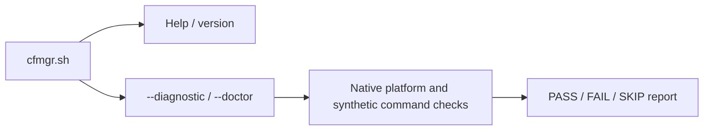

# 🧩 Architecture

[← README](../README.md) · [Development](development.md) · [Compatibility](compatibility.md) · [Implementation plan](../PLAN.md)


This is a working developer guide. It separates implemented foundations from
the intended manager; [PLAN.md](../PLAN.md) owns the detailed contracts,
acceptance checklist and implementation record. This guide and the other
repository documentation are reviewed at major milestones and before each
ten-percentage-point checkpoint; implementation status stays current throughout
development.

## 🧱 Current implementation

The repository entry point is `cfmgr.sh`; runtime code is grouped in `modules/`.
POSIX shell sources the shell helpers and invokes the awk parsers directly.
There is no generated or compiled main script. The planned installed command
remains `cfmgr`.

The development entry supports help, version and the two equivalent health
commands. It does not install CFMgr or start a feature.



| Module | Implemented responsibility | Boundary |
| --- | --- | --- |
| `cfmgr.sh` | Development command dispatch and bounded module-path resolution | No operational startup or repair |
| `modules/diagnostic.sh` | Native health report, private synthetic probes and cleanup | Entware execution and full runtime inventory remain incomplete |
| `modules/lib/common.sh`, `modules/lib/ip.sh`, `modules/lib/json.awk` | Shared text validation, address normalization and bounded JSON framing | Libraries/parsers only; no feature startup or provider calls |
| `modules/lib/mountinfo.awk`, `modules/lib/storageinfo.awk` | Parse mount, device and primary-superblock observations | Snapshot facts do not establish persistent volume identity, writability or live mount stability |
| `modules/lib/io.sh`, `modules/lib/storage.sh`, `modules/lib/entware.sh` | Bounded captures and retained-storage observation/admission | Internal callbacks; no operational package execution or CLI integration |
| `modules/lib/dependency_lock.sh`, `modules/lib/isolation.sh` | Cooperative lock and checked native, fixed-probe, read-only execution-root, native-data-root, quota-limited native-tmp-root and retained Entware-root lifecycles | Internal APIs; uncertainty retains guards and no entry exposes an operational CLI |
| `modules/lib/native_config.sh` | Inside an active IO callback, stage opaque `/etc/hosts` and `/etc/resolv.conf` bytes into the caller-owned private image outside IO scratch | Fixed files only; no syntax/readiness checks, execution, or broader native configuration closure |
| `modules/lib/entware_root.sh` | Attach an already-admitted Entware directory to the checked native root through held FD9 | Requires independent storage admission and original FD8/FD9; the ledger format alone grants no authority; callback is native-only |
| `modules/lib/supervision.sh`, `modules/lib/closure.sh` | Fixed-probe completion and bounded executable-image staging | Caller must separately approve provenance and executable closure; these are not a general package runner |
| `modules/helpers/worker.sh` | Native process-group admission and guarded aggregate-deadline supervision | Internal native callback only; operational scheduling and package/feature launch remain separate |
| `modules/helpers/bootstrap.sh` | Install missing dependencies or explicitly reinstall selected direct packages through Entware opkg, then verify them | Internal synchronous backend; admitted mount, serialized worker and hook scheduling remain caller prerequisites; doctor never calls it |

The parsing modules are tested foundations, not yet a complete operational call
path. See [development checks](development.md#-run-checks) for reproducible host
validation and the separate BusyBox evidence requirement.

### Source layout and loading

```text
cfmgr.sh                Public development command dispatch
modules/
├── diagnostic.sh       Current native health-report feature
├── helpers/            Dependency bootstrap and supervised worker helpers
├── lib/                Shared shell libraries and awk parsers
└── hooks/              Reserved for thin firmware-hook/cron entry scripts
tests/                  Host tests and controlled kernel fixtures
tools/                  Developer validation tools
docs/                   Architecture, development and user guidance
```

Feature modules belong directly in `modules/`; shared code belongs in `lib/`,
and supporting workers, updaters, or dependency setup belong in `helpers/`.
Firmware-hook and cron entry scripts belong in `hooks/` and should stay thin.
The hooks directory is currently only a placeholder. Feature logic should use
small explicit interfaces and shared libraries rather than copied helpers.
The entry point resolves and sources the diagnostics module explicitly; there is
no automatic loading of arbitrary files or directories. Menu, setup, and
dispatch connections will be added as their features are implemented.

### Adding a feature

Keep a feature's behavior in its own module, such as the future Cloudflared,
DDNS or IP-Sync module. Define its configuration, setup/teardown, status and
action interfaces alongside that implementation. The menu and setup flow then
call those interfaces; they should not contain copies of the feature logic.
Shared parsing, IO, storage and locking belong in `lib/`. A worker or updater
belongs in `helpers/`, and its thin firmware or cron entry belongs in `hooks/`.
Repository folders do not change Merlin's installed hook destinations.

Loading and dependencies stay explicit, and sourcing a shared shell library
only defines its functions. A new module also needs focused behavior tests,
current documentation and, once distribution is implemented, entries in the
same verified package manifest. Nested paths such as `lib/common.sh` must stay
relative to the installed manager directory and retain traversal, duplicate,
hash and generation checks. The current CLI diagram above shows implemented
loading; this extension pattern guides the future menu/setup integration.

## 🗂️ Storage and authority

| Location | Intended responsibility |
| --- | --- |
| `/jffs/scripts/cfmgr` | Installed public entry point |
| `/jffs/addons/CFMgr.d/` | Verified manager modules, private configuration and bounded durable recovery |
| `/jffs/addons/CFMgr.d/config` | Authoritative settings, typed credentials, saved activation and the developer flag |
| `/jffs/addons/CFMgr.d/catalog.txt` | Separate editable source selector and named module URLs |
| Private RAM workspace | Transient requests, queues, observations, captures and staging |
| Verified Entware volume | Selected packages, cloudflared binary, tunnel runtime files and optional custom logs |
| User-selected backup drive | Manual data-only archives under `CFBackup/` |

Persistent settings and recovery stay in JFFS; frequent observations and retry
state stay in RAM. Missing storage must preserve saved intent and report waiting
or incomplete work. A mount label, `/dev/sd` name, directory or executable alone
cannot establish the expected volume.

The storage observer joins the held directory's mount ID to the current mount
table, checks the block device number and reads the primary ext superblock through
the original open descriptor. It repeats the path/mount/device checks before
staging its result. The descriptors remain open through observation and staging;
the private workspace is cleaned before the result is published.

The internal `cfmgr_storage_with` API instead runs a trusted callback after all
checks, passing the resolved directory, complete volume ledger and caller
arguments while both descriptors remain held. It returns status without
publishing callback output. The callback owns any external transaction guard
and cleanup; mounted trees and asynchronous users must stay outside IO scratch.
Ordinary return restores the caller's descriptors before cleanup. A signal-driven
exit may retain them until process exit, so interrupted setup must preserve its
external guard.

`cfmgr_entware_with` adds an admission check within that retained callback. The
caller supplies an independently approved UUID and filesystem subtree; the
current observation cannot approve itself. Both mount and superblock option
lists must contain `rw` and must not contain `ro` or `noexec`. The admitted
native callback receives the same complete ledger and original descriptors.
This check does not test physical media writes or make a later path lookup safe;
the operational package worker still needs its own lifetime and mount-loss
contract.

`cfmgr_dependency_lock_with` reserves FD7 for native nonblocking `flock`, leaving
FD8/FD9 available to the storage owner. Its private RAM parent and retained
`dependencies.lock` file must stay at the same paths for every holder's lifetime.
The function never unlinks the file or explicitly unlocks the shared open file
description. A cooperative child that inherits FD7 continues to exclude new
callers after the wrapper returns or is interrupted. A busy or failed acquisition
does not invoke the callback. This does not establish that arbitrary package
scripts preserve the descriptor or that their descendants have finished.

`cfmgr_worker_group_check` reads the calling shell's own native proc record and
requires its actual PID and process group to match the original shell PID. The
matched Merlin cron source creates a group before executing a job; the runtime
check remains mandatory because cron does not check that operation's result.
An ordinary nested shell fails admission even when its POSIX `$$` is unchanged.

`cfmgr_worker_deadline_with` requires that admitted group to contain only its
trusted work and an existing private RAM guard. Its total budget includes startup,
callback cleanup, completion handoff and termination grace. One native watchdog
arms before the callback can run. Successful completion requires a timely done
marker, irreversible watchdog disarm, acknowledgement and a successful exact-child
wait. An ordinary callback failure can return only through the same handoff.
Uncertainty or expiry instead cancels the current group with TERM followed by KILL;
it never signals a saved numeric PID or group ID. The guard remains on every
outcome for the higher lifecycle owner to resolve.

This internal controller does not launch packages or authorize removing their
mounts. Kernel-uninterruptible work, scheduling delays and externally stopped or
killed supervisors prevent an unconditional termination deadline. Filesystem
quiescence and arbitrary descendants require the separate root-lifetime gate.

The internal `cfmgr_isolation_with` API builds on that retained callback. It
reserves a private guard outside IO scratch, checks the RAM/source topology,
then binds `/dev/null` and the held Entware directory into its own root. A
trusted synchronous callback receives the root, complete volume ledger and
unchanged arguments only after both mounts pass verification.

Cleanup checks each recorded mount again, removes Opt before null, and proves
both absent before deleting the guard. Busy, changed or uncertain mounts and
interrupted operations leave the guard for recovery. Existing guards are never
adopted or removed automatically. The native callback API does not launch a
process inside the root. A separate internal fixed-probe entry connects image
staging and supervision as described below; neither entry exposes an operational CLI action.

A separate `cfmgr_isolation_root_with` entry prepares the readonly root
foundation without acquiring Entware or launching a payload. It reserves a fresh
execution guard, stages empty `/opt` and `/tmp` fallbacks, and verifies a private
root bind with readonly, nodev and nosuid flags. A trusted synchronous native
observer receives the complete root ledger while FD6 holds that exact mount;
fdinfo mount identity and directory identity must both agree. The scoped
descriptor closes before checked ordinary unmount and exact absence
verification.

`cfmgr_isolation_native_root_with` extends that lifecycle with four fixed
read-only native views: `/bin`, `/sbin`, `/lib`, and `/usr`. It verifies each
source, mount identity, readonly flags and topology, then presents the populated
root ledger to the same narrowly scoped native observer. Production sources must
be on the approved readonly UBIFS or squashfs firmware root; the explicit host
fixture also admits a readonly tmpfs source to prove real mount behavior. This is
a tested internal construction primitive, not an Entware environment: native
configuration and executable/loader/resolver/TLS/NSS closure, approved writable
children, ordinary opkg execution and operational worker/menu/startup wiring
remain unfinished. Host fixtures exercise the lifecycle, and a ninth Linux
namespace consumer is included for actual mount/descriptor validation. Its
checkpoint result is tracked in PLAN.md; neither establishes router acceptance.

`cfmgr_isolation_native_data_root_with` composes the fixed native views with
opaque staging of `/etc/hosts` and `/etc/resolv.conf` before any bind. The helper
uses the existing trusted IO capture owner, limits each file to 65,536 bytes,
and accepts it only when the captured and staged bytes match exactly; NUL bytes,
truncation and partial publication fail. Empty files and final newline bytes are
preserved. It does not parse resolver settings, test DNS readiness or validate
the contents for execution. The staged `etc` tree becomes read-only with the
base root bind.

This is an internal native-data lifecycle, not an operational configuration
reader or runnable system root. Helper success is insufficient by itself: the
enclosing IO cleanup must also succeed before the observer's ordinary callback
status can return. Failures retain the execution guard and any partial staging
for review. Existing bare-root and native-root APIs keep their contracts. The
native-data callback remains synchronous native observation only; chroot,
payload/opkg execution, `HOME`, private writable `/tmp`, and complete ELF,
resolver, TLS or NSS closure are not provided.

`cfmgr_isolation_native_tmp_root_with` adds one private tmpfs child to the exact
five-child layout: `/bin`, `/sbin`, `/lib`, `/usr`, and `/tmp`. Its production
inputs are `RAMROOT`, `GUARD`,
`LIMIT_KIB`, `INODE_LIMIT`, the mount and storage parsers, a callback, and optional
callback arguments. The two quota arguments must be canonical decimal integers:
size is 64–65,536 KiB in multiples of 64; inode count is 8–8,192. The owner
checks the exact tmpfs identity, `rw,nosuid,nodev,exec` options, mode `0700`, and
the requested `size` and `nr_inodes` values after mounting and again before
teardown. It creates an empty mode-`0700` `/tmp/cfmgr-home` directory. The
observer's process `HOME` remains unchanged; setting that logical home belongs
to a future launcher.

These are kernel-enforced usage ceilings, not a RAM reservation or a measure of
available memory headroom. The native-data API remains unchanged and keeps its
read-only empty `/tmp` fallback. The native-tmp API still admits only a trusted
synchronous native observer: no chroot, payload or opkg execution, readiness
probe, or operational worker. Teardown uses ordinary unmount on the tmpfs first,
then removes native views in reverse order and finally the base root. It uses
64 unique mount-query slots, exactly the configured ceiling.

The private temporary area is not an Entware environment. The separate retained-
Opt composition below adds a writable Entware child only for storage already
admitted by its caller; it does not supply complete native loader, ELF, resolver,
TLS or NSS closure or operational package execution.

`cfmgr_isolation_entware_root_with` composes the existing native-data and
native-tmp layout with an already-admitted Entware directory. Its production
arguments are `RESOLVED`, the complete `VOLUME` report, `RAMROOT`, `GUARD`,
`LIMIT_KIB`, `INODE_LIMIT`, the mount and storage parsers, a synchronous native
observer, and optional observer arguments. Call it only inside the callback of
an independent Entware storage-admission owner, with the original block
descriptor FD8 and directory descriptor FD9 still held. A valid report frame or
canonical UUID string is not storage approval; the report must come from that
independent admission and its configured identity decision.

The wrapper rechecks the saved source facts and topology and observes the real
FD8/FD9 identities five times. It binds only `/proc/self/fd/9` at `root/opt`,
then verifies the exact child identity and effective `rw,nosuid,nodev,exec`
flags. The six-child root contains `/bin`, `/sbin`, `/lib`, `/usr`, `/tmp`, and
`/opt`; its complete root ledger and the original volume report are passed to
the observer before its unchanged arguments. The observer cannot run a payload,
chroot, start asynchronous users or retain descriptors, and `HOME` is not
replaced.

This composition does not install Entware, invoke opkg, add device nodes, or
provide complete loader/helper, TLS or NSS closure. It does not prove physical
filesystem identity or router acceptance. After callback return, the owner
rechecks the full layout and ordinarily unmounts Opt first. It verifies the
exact empty readonly Opt fallback before removing `/tmp`, then removes native
views in reverse order and the base root. Busy or uncertain teardown returns
129 and retains the guard; an ordinary callback status returns only after all
root and IO cleanup succeeds. The layout uses exactly 78 unique queries within
its fixed 78-query ceiling. Older root and native-data APIs retain their
existing contracts.

The execution guard remains on every outcome. A completion marker describes
verified filesystem teardown; the enclosing IO transaction must also clean up
successfully before the observer's ordinary status can return. Any incomplete
step after reservation reports uncertainty. These root entries do not yet provide
writable Entware storage, package execution or scheduling.
Existing native and fixed-probe APIs retain their separate cleanup contracts.

The retained-storage profile covers dynamic-revision ext2/ext3/ext4 primary
superblocks; the separate readonly-root foundation uses private tmpfs or ramfs.
Other filesystems, alternate `sb=` mounts and missing mount-ID support need
separate profiles. A matching observation does not prove writability, filesystem
health or uninterrupted device identity, and it cannot authorize a later write
through a freshly resolved path.

Backups contain configuration and inventoried data, including credentials; they
do not restore executable code or live process/queue/transaction state. The
planned restore path validates data and rebuilds the manager's own integrations;
that operational path is not implemented yet.

## ⚙️ Intended execution boundaries

The runtime language is BusyBox-compatible POSIX `sh`. Python, pytest and the
virtualenv are developer tools only. Shared operational prerequisites are `jq`,
`coreutils-timeout` and `coreutils-sha256sum`; scoped DNS/locking additions follow
the [compatibility policy](compatibility.md). Native recovery and health checks
must remain available when those packages cannot run.

| Boundary | Required behavior |
| --- | --- |
| Entry and hooks | Validate the action, apply guards and admit bounded work; no menu or unbounded wait from a firmware hook |
| Shared controller | Check current configuration, prerequisites, ownership and retry eligibility before starting work |
| DDNS and IP-Sync | Share current IPv4/IPv6 observations, retain independent outcomes and reconcile only configured targets |
| Cloudflared controller | Keep saved activation, binary maintenance, readiness and owned-process recovery distinct |
| Installer and updater | Verify the selected generation and complete staged artifacts before replacement; retain recoverable failures |
| Status and health | Report evidence without starting services, installing dependencies or contacting providers |

The DDNS hook is the explicit bounded-wait exception so it can report Merlin's
success/failure result. It must defer promptly during boot or missing readiness.
Only a failed or timed-out firmware DDNS attempt schedules the additional CFMgr
retry; successful completion does not schedule a forced update. Exact boot
release, overlap handling and the whole-action deadline remain implementation
gates.

<details>
<summary>Why checking a command or mount once is insufficient</summary>

An installed-package record does not prove that its executable loads, supports
the required arguments or still belongs to the expected mounted volume. A
successful parser exit does not prove its output was written completely. A
live process does not prove tunnel connectivity.

The intended controller checks the evidence appropriate to each boundary and
preserves unknown outcomes. Installed-opkg selection and native deadline
supervision have internal implementations; their operational composition,
mount-loss handling and feature startup still need implementation and validation.
The fixed-probe helpers have a narrower contract and do not establish those
guarantees.

</details>

<details>
<summary>🔒 Internal dependency execution proofs</summary>

Operational dependencies are to be installed by the existing Entware `opkg`
using its configured repositories and normal package/library resolution. CFMgr
checks required capabilities and verifies the result. Cloudflared is handled
directly through release binaries matched to supported kernel and userspace
architecture/ABI combinations; the kernel architecture alone is insufficient.
The direct-IPK bootstrap was retired. Supplied-manifest isolated-image helpers
remain internal execution proofs with no operational CLI wiring. They do not
establish an installer or replace opkg's package-resolution mechanism.

Entware's loader reads absolute `/opt` paths before a program starts. An
explicit loader path alone therefore cannot contain execution when the public
mount path changes. The fixed-probe profile uses native bind mounts and chroot
to separate verified executable bytes from the mutable installation destination.
A small private RAM image provides the admitted programs, loader and libraries
at `/opt`, with a verified read-only bind and no preload file. The earlier restricted
installation proposal would expose the retained Entware directory separately at
`/offline/opt`. Version probes do not mount the mutable Entware directory
inside their root. Artifact provenance and ELF-graph admission remain caller
prerequisites; accepting supplied hashes does not establish trust. Before calling
the internal probe entry, the owner must construct/acquire the approved manifest
within 4096 original bytes in stable private RAM. Staging validates its length
after reading through EOF, so that check is not a bounded acquisition primitive.

The earlier direct-IPK catalogue, native fetch/extraction and acquisition
lifecycle have been retired. Their development history remains in Git and the
plan, but operational dependency setup does not use those APIs or choose package
versions/libraries itself. The supplied-manifest closure and fixed-probe helpers
remain independent internal proofs; they do not constrain opkg's dependency
resolution or constitute the normal package installer.

`cfmgr_bootstrap_dependencies` selects the shared jq, timeout and SHA256
capabilities, optionally adding tunnel DNS or Entware locking. Its production
paths are fixed under `/opt`; the explicit test entry selects a fixture root.
If all selected capabilities are usable, it runs no package command. Otherwise
it performs one ordinary opkg update and installs only missing/unusable direct
packages, then checks every selected capability again. A usable jq supplied by
an alternative package needs no replacement. Failed package work or failed
post-checks return failure; a later invocation rechecks rather than trusting a
success cache. The separate `cfmgr_bootstrap_reinstall` backend runs one update,
force-reinstalls every selected direct package, then repeats all selected checks.
Its operational menu and worker wiring remain unfinished.

Entware is required for operational features. This synchronous backend must be
called by an admitted, serialized dependency worker after verifying the expected
mounted storage; file existence alone is not that proof. It does not provide an
aggregate deadline or mount-loss containment, and the worker/feature launch
integration remains unfinished. `--doctor` and `--diagnostic` use only native
helpers and never invoke this backend, opkg or unverified Entware executables.

The existing native profile binds the expected Entware directory and `/dev/null`.
The outer native owner checks mount identity and removes its
exact mounts before deleting staging. Uncertain cleanup retains a guard and
workspace for recovery. The native ownership and cleanup code is in
`modules/lib/isolation.sh`. Focused host fixtures cover its fault matrix; the separate
[Linux kernel lane](development.md#isolated-linux-kernel-checks) exercises actual
mounts, busy cleanup, interruption and controlled static/dynamic executable
mapping behavior. Its namespaces and compiler are developer tools only. The
[plan](../PLAN.md#mount-snapshot-parser-contract--current-package) records its
proof gates and the distinction from hostile-root security isolation.

Before any bind, the owner checks the native BusyBox unmount capability using
bounded help output. It selects the older `-D -n` or newer `-n` command while
preserving ordinary unmount and avoiding loop-device and mtab side effects.
Unknown capability stops the attempt before mounts; an actual cleanup failure
never triggers a retry with different flags. Firmware version numbers alone
do not select this behavior.

For contained probes, cleanup uses ordinary unmount's busy check:
admitted executable mappings retain the exact execution-image bind. Native
launcher completion and successful verified unmount are both required before
staging can be removed. A bounded polling helper records completion separately
from exit status; a polling deadline leaves the launcher unproved and the guard
retained. It never signals a saved numeric PID. The separate fixed-probe entry
accepts only the timeout or gzip version probe. It clears the active launcher
only when nothing started or the supervisor validated completion; a returned
failure or deadline alone cannot authorize cleanup. Even a pre-bind staging
failure requires a fresh unchanged/private RAM topology check before removal.
This does not promise complete process reaping or a hard deadline for blocked
kernel IO. Controlled host ELF tests do not expand the native callback's scope
or prove Entware ABI or Merlin runtime acceptance.

</details>

## 📦 Modules and forks

**Planned distribution contract; config/catalog downloads and updates are not
implemented yet.** Modules remain readable source files. Repository-root
`catalog.txt` is downloaded to `/jffs/addons/CFMgr.d/catalog.txt` from the selected
repository snapshot. Its shipped selector defaults to `main`; developers can
manually select `develop` or a full commit hash in the separate
`/jffs/addons/CFMgr.d/catalog.txt` file. The developer flag remains in `config`.
Resolve a branch once, then acquire one immutable repository snapshot with its
manifest and hashes. Never combine newer per-file fallbacks
or execute catalog contents as shell code.

The **developer flag** defaults to `false`. When `true`, branch/commit switches,
updates and force reinstalls preserve the existing router `catalog.txt` unchanged,
and normal manager update checks are suppressed. Download a default catalog only
when the local file is missing; malformed existing catalog data requires repair.
The detailed catalog contract and fork examples are in the [development guide](development.md#-module-catalog-and-forks).

Normal startup and hooks do not fetch missing manager code. Installation and
repair own package acquisition; dependency checks do not authorize arbitrary
module downloads.
