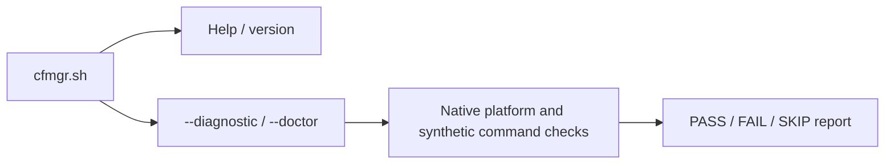

# 🧩 Architecture

[← README](../README.md) · [Development](development.md) · [Compatibility](compatibility.md) · [Implementation plan](../PLAN.md)


This is a working developer guide. It separates implemented foundations from
the intended manager; [PLAN.md](../PLAN.md) owns the detailed contracts,
acceptance checklist and implementation record. This guide and the other
repository documentation are reviewed at major milestones and before each
ten-percentage-point checkpoint; implementation status stays current throughout
development.

## 🧱 Current implementation

CFMgr is CLI-only: terminal menus and command-line entry points are the approved
interface. A browser GUI is an optional future idea outside the current roadmap;
it requires a separate user decision before design or implementation.

The repository entry point is `cfmgr.sh`; runtime code is grouped in `modules/`.
POSIX shell sources the shell helpers and invokes the awk parsers directly.
There is no generated or compiled main script. The planned installed entry is
`/jffs/scripts/cfmgr.sh`; its supporting modules and catalog live under
`/jffs/addons/CFMgr.d/`.

The development entry supports help, version and the two equivalent health
commands. It does not install CFMgr or start a feature.



| Module | Implemented responsibility | Boundary |
| --- | --- | --- |
| `cfmgr.sh` | Development command dispatch and bounded module-path resolution | No operational startup or repair |
| `modules/diagnostic.sh` | Native health report, private synthetic probes and cleanup | Entware execution and full runtime inventory remain incomplete |
| `modules/lib/common.sh`, `modules/lib/ip.sh`, `modules/lib/json.awk` | Shared text validation, address normalization and bounded JSON framing | Libraries/parsers only; no feature startup or provider calls |
| `modules/lib/mountinfo.awk`, `modules/lib/storageinfo.awk` | Parse mount, device and primary-superblock observations | Snapshot facts do not establish persistent volume identity, writability or live mount stability |
| `modules/lib/io.sh`, `modules/lib/storage.sh`, `modules/lib/entware.sh` | Bounded captures and retained-storage observation/admission; IO tool resolution includes the finite `rmdir` prerequisite | Internal callbacks; no operational package execution or CLI integration; capture allowlist is unchanged |
| `modules/lib/dependency_lock.sh`, `modules/lib/isolation.sh` | Cooperative lock and checked native, fixed-probe, read-only execution-root, native-data-root, quota-limited native-tmp-root and retained Entware-root lifecycles | Internal APIs; uncertainty retains guards and no entry exposes an operational CLI |
| `modules/lib/native_config.sh` | Inside an active IO callback, stage opaque `/etc/hosts` and `/etc/resolv.conf`; an extended API adds fixed NSS, wget, OpenSSL config and CA files | Data copies only; no syntax, trust, readiness, execution or broader closure approval; legacy root entries remain two-file |
| `modules/lib/native_config_root.sh` | Select the fixed extended-config composition over the retained-Opt/device root lifecycle | Source-only native observer API; six files staged before bind; no arbitrary payload or package-install wiring |
| `modules/lib/native_exec.sh` | Probe one fixed native shell/BusyBox command or the installed `opkg --version` inside an already checked native-config root | Explicit synchronous callback exceptions; fixed commands only; caller owns the deadline and root authority; no general executable or DNS/TLS admission |
| `modules/helpers/native_probe.sh` | Compose the fixed native shell probe with the existing deadline, retained-storage and checked native-config-root owners | Source-only ten-argument internal API; no CLI, cron installation, operational worker, package installation or network action |
| `modules/helpers/dependencies.sh` | Compose original-shell process-group admission, stable CFMgr locking, aggregate deadline, retained storage, native-config root, fixed dependency backend and checked release | Source-only fourteen-argument API; no CLI, cron installation, readiness/retry flow or router acceptance |
| `modules/lib/entware_root.sh` | Attach an already-admitted Entware directory to the checked native root through held FD9 | Requires independent storage admission and original FD8/FD9; the ledger format alone grants no authority; callback is native-only |
| `modules/lib/native_devices.sh` | Add fixed private-RAM `/dev/null` and `/dev/urandom` nodes to the retained-Opt native root | Only these two root-owned nodes; checked mount views do not lease inode identity continuously or revoke already-open descriptors |
| `modules/lib/supervision.sh`, `modules/lib/closure.sh` | Fixed-probe completion and bounded executable-image staging | Caller must separately approve provenance and executable closure; these are not a general package runner |
| `modules/helpers/worker.sh` | Native process-group admission and guarded aggregate-deadline supervision | Internal compositions only; operational scheduling and package/feature launch remain separate |
| `modules/helpers/bootstrap.sh` | Install missing dependencies or explicitly reinstall selected direct packages through Entware opkg, then verify them | Internal synchronous backend; admitted mount, serialized worker and hook scheduling remain caller prerequisites; doctor never calls it |

The parsing modules are tested foundations, not yet a complete operational call
path. See [development checks](development.md#-run-checks) for reproducible host
validation and the separate BusyBox evidence requirement.

### Source layout and loading

```text
cfmgr.sh                Public development command dispatch
modules/
├── diagnostic.sh       Current native health-report feature
├── helpers/            Dependency bootstrap and supervised worker helpers
├── lib/                Shared shell libraries and awk parsers
└── hooks/              Reserved for thin firmware-hook/cron entry scripts
tests/                  Host tests and controlled kernel fixtures
tools/                  Developer validation tools
docs/                   Architecture, development and user guidance
```

Feature modules belong directly in `modules/`; shared code belongs in `lib/`,
and supporting workers, updaters, or dependency setup belong in `helpers/`.
Firmware-hook and cron entry scripts belong in `hooks/` and should stay thin.
The hooks directory is currently only a placeholder. Feature logic should use
small explicit interfaces and shared libraries rather than copied helpers.
The entry point resolves and sources the diagnostics module explicitly; the
native configuration, retained-Opt and fixed-device helpers are source-only
internal APIs. There is no automatic loading of arbitrary files or directories.
Menu, setup, and dispatch connections will be added as their features are
implemented.

### Adding a feature

Keep a feature's behavior in its own module, such as the future Cloudflared,
DDNS or IP-Sync module. Define its configuration, setup/teardown, status and
action interfaces alongside that implementation. The menu and setup flow then
call those interfaces; they should not contain copies of the feature logic.
Shared parsing, IO, storage and locking belong in `lib/`. A worker or updater
belongs in `helpers/`, and its thin firmware or cron entry belongs in `hooks/`.
Repository folders do not change Merlin's installed hook destinations.

Loading and dependencies stay explicit, and sourcing a shared shell library
only defines its functions. A new module also needs focused behavior tests,
current documentation and, once distribution is implemented, entries in the
same verified package manifest. Nested paths such as `lib/common.sh` must stay
relative to the installed manager directory and retain traversal, duplicate,
hash and generation checks. The current CLI diagram above shows implemented
loading; this extension pattern guides the future menu/setup integration.

## 🗂️ Storage and authority

Integration follows Merlin’s official [Addons API](https://github.com/RMerl/asuswrt-merlin.ng/wiki/Addons-API),
[User scripts](https://github.com/RMerl/asuswrt-merlin.ng/wiki/User-scripts) and
[Custom config files](https://github.com/RMerl/asuswrt-merlin.ng/wiki/Custom-config-files)
guidance, checked against the supported firmware source. Revisit affected
conventions when implementation changes and during milestone reviews; record
version differences and design decisions in the plan. Firmware configuration
overrides and shared WebUI settings are separate from CFMgr’s private config.

| Location | Intended responsibility |
| --- | --- |
| `/jffs/scripts/cfmgr.sh` | Installed public entry point |
| `/jffs/addons/CFMgr.d/` | Verified manager modules, private configuration and bounded durable recovery |
| `/jffs/addons/CFMgr.d/config` | Authoritative settings, typed credentials, saved activation and the developer flag; generated locally from defaults on fresh install |
| `/jffs/addons/CFMgr.d/catalog.txt` | Separate editable source selector and named module URLs |
| Private RAM workspace | Transient requests, queues, observations, captures and staging |
| Verified Entware volume | Selected packages, cloudflared binary, tunnel runtime files and optional custom logs |
| User-selected backup drive | Manual data-only archives of CFMgr-owned setup and inventoried data under `CFBackup/` |

Persistent settings and recovery stay in JFFS; frequent observations and retry
state stay in RAM. Missing storage must preserve saved intent and report waiting
or incomplete work. A mount label, `/dev/sd` name, directory or executable alone
cannot establish the expected volume.

The extensionless `config` is private router data. The public repository ships
neither a config file nor a config template; fresh installation generates it
from defaults in the implementation, after checking for retained setup.
Updates and reinstalls preserve existing settings under the migration contract.
Planned full uninstall **KEEP** retains settings and recovery data. Explicit
**WIPE** removes `/jffs/addons/CFMgr.d/` itself after verified owned cleanup is
complete. An incomplete cleanup retains recovery evidence; it cannot report a
successful wipe. Reset retains the verified manager package and regenerates
passive defaults instead of deleting the entire package directory.

The storage observer joins the held directory's mount ID to the current mount
table, checks the block device number and reads the first 1,152 bytes of the
primary ext superblock through the original open descriptor. It repeats the
path/mount/device checks before staging its result. The descriptors remain open
through observation and staging; the private workspace is cleaned before the
result is published.

### Bounded parser and IO contracts

`modules/lib/json.awk` accepts a stable private input up to 64 KiB with a
separately checked byte count, nesting limited to 32 containers, 4,096 value
nodes and 16 KiB per decoded string. Its token ledger is capped at 128 KiB
including the terminal count footer; numeric text is preserved. Consumers set
`LC_ALL=C` and check parser status, exact framing, byte count and sequential
records; this does not establish configuration semantics or authorize a provider
request. `modules/lib/ip.sh`
normalizes IPv4/IPv6 text, including lower-case shortest IPv6 with longest-leftmost
zero compression. Valid syntax alone does not establish public-address
eligibility, WAN selection or freshness.

`modules/lib/mountinfo.awk` chooses the deepest mount covering a canonical path
and rejects ambiguous covering ancestors. It consumes a stable snapshot capped
at 64 KiB, 1,024 records, 8,192 bytes per line and a 4,096-byte target. It
calculates the target's path inside the selected filesystem, including bind
mount roots. Standard mountinfo path escapes are decoded; the internal byte-encoded result has a
terminal byte-count footer. Its caller provides `LC_ALL=C`, the independently
checked snapshot byte count and `CFMGR_MOUNT_TARGET` in the environment. Numeric
mount IDs remain exact text. These facts are observations, not persistent
identity or write authority.

`modules/lib/storageinfo.awk` parses stable private native observations with
independently checked byte counts, `LC_ALL=C` and a literal mode. Inputs are at
most 4 KiB (fdinfo up to 64 records), preserving large numeric IDs as text. It
rejects label-bearing `blkid` records because firmware label formatting can
imitate a UUID field. Status `0` is a complete framed result, `1` malformed or
rejected input, `2` invocation error, and `3` unavailable identity. A framed UUID
still requires independent expected-volume approval. The storage parser receives
its expected device through `CFMGR_BLKID_DEVICE`; avoid awk `-v` for this value
because it could interpret backslashes.

`modules/lib/io.sh` has no source-time side effects. The caller supplies a
trusted RAM parent, callback and verified parser path; production tool paths are
fixed and inherited path overrides are ignored. Disable tracing before passing
arguments. It provides private callback workspaces and capture slots 0–15;
each accepted stdout/stderr stream is at most 65,536 bytes, and accepted stream
data totals at most 2 MiB. Its interfaces are:

| Function | Caller contract |
| --- | --- |
| `cfmgr_io_with_workspace ROOT CALLBACK [ARGS...]` | Try up to eight private mode-0700 workspace names; suppress callback output and clean up before returning its ordinary status. |
| `cfmgr_io_with_report ROOT CALLBACK [ARGS...]` | Same ownership, requiring exactly one explicitly staged report before success. |
| `cfmgr_io_stage_report PAYLOAD` | Stage a nonempty ASCII report up to 65,536 bytes inside its owner callback. |
| `cfmgr_io_capture SLOT OUT_LIMIT ERR_LIMIT TOOL [ARGS...]` | Capture bounded producer output and status into private files; slots are consumed even on failure. |
| `cfmgr_io_mount_snapshot ROOT TARGET PARSER` | Acquire and parse mountinfo; emit a framed result only after workspace cleanup. |

Capture status `0` means transport completed, not that the producer succeeded;
the caller must read the complete `.status` record before using output. An
overflow byte is captured for exact limit checks; supported shells yield a
132,096-byte physical ceiling per stream, while accepted stream data totals at
most 2 MiB. IO, limit or cleanup failures return `1`, invalid usage returns `2`,
and no covering mount remains `3`. Callback status otherwise passes through
after owned cleanup; handled HUP/INT/TERM exits remain `129`/`130`/`143`. The
owner preserves caller state; external callers must forward signals or supervise
it. IO has no deadline for a hung native executable. Failed partial captures stay
private until owner cleanup.

Hex validation still requires nonempty lowercase byte pairs without NUL; path
validation additionally requires an absolute path without empty, `.` or `..`
components, with `/` accepted explicitly. Ordinary inputs avoid repeated byte
walking only when no forbidden encoding can be present. Suspicious matches,
including matches between byte boundaries, use the unchanged strict walkers.

The internal `cfmgr_storage_with` API instead runs a trusted callback after all
checks, passing the resolved directory, complete volume ledger and caller
arguments while both descriptors remain held. It returns status without
publishing callback output. The callback owns any external transaction guard
and cleanup; mounted trees and asynchronous users must stay outside IO scratch.
Ordinary return restores the caller's descriptors before cleanup. A signal-driven
exit may retain them until process exit, so interrupted setup must preserve its
external guard.

`cfmgr_entware_with` adds an admission check within that retained callback. The
caller supplies an independently approved UUID and filesystem subtree; the
current observation cannot approve itself. Both mount and superblock option
lists must contain `rw` and must not contain `ro` or `noexec`. The admitted
native callback receives the same complete ledger and original descriptors.
This check does not test physical media writes or make a later path lookup safe;
the operational package worker still needs its own lifetime and mount-loss
contract.

`cfmgr_dependency_lock_with` reserves FD7 for native nonblocking `flock`, leaving
FD8/FD9 available to the storage owner. Its private RAM parent and retained
`dependencies.lock` file must stay at the same paths for every holder's lifetime.
The function never unlinks the file or explicitly unlocks the shared open file
description. A cooperative child that inherits FD7 continues to exclude new
callers after the wrapper returns or is interrupted. A busy or failed acquisition
does not invoke the callback. This does not establish that arbitrary package
scripts preserve the descriptor or that their descendants have finished.

`cfmgr_worker_group_check` reads the calling shell's own native proc record and
requires its actual PID and process group to match the original shell PID. The
matched Merlin cron source creates a group before executing a job; the runtime
check remains mandatory because cron does not check that operation's result.
An ordinary nested shell fails admission even when its POSIX `$$` is unchanged.

`cfmgr_worker_deadline_with` requires that admitted group to contain only its
trusted work and an existing private RAM guard. Its total budget includes startup,
callback cleanup, completion handoff and termination grace. One native watchdog
arms before the callback can run. Successful completion requires a timely done
marker, irreversible watchdog disarm, acknowledgement and a successful exact-child
wait. An ordinary callback failure can return only through the same handoff.
Uncertainty or expiry instead cancels the current group with TERM followed by KILL;
it never signals a saved numeric PID or group ID. The guard remains on every
outcome for the higher lifecycle owner to resolve.

This internal controller does not launch packages or authorize removing their
mounts. Kernel-uninterruptible work, scheduling delays and externally stopped or
killed supervisors prevent an unconditional termination deadline. Filesystem
quiescence and arbitrary descendants require the separate root-lifetime gate.

The internal `cfmgr_isolation_with` API builds on that retained callback. It
reserves a private guard outside IO scratch, checks the RAM/source topology,
then binds `/dev/null` and the held Entware directory into its own root. A
trusted synchronous callback receives the root, complete volume ledger and
unchanged arguments only after both mounts pass verification.

Cleanup checks each recorded mount again, removes Opt before null, and proves
both absent before deleting the guard. Busy, changed or uncertain mounts and
interrupted operations leave the guard for recovery. Existing guards are never
adopted or removed automatically. The native callback API does not launch a
process inside the root. A separate internal fixed-probe entry connects image
staging and supervision as described below; neither entry exposes an operational CLI action.

A separate `cfmgr_isolation_root_with` entry prepares the readonly root
foundation without acquiring Entware or launching a payload. It reserves a fresh
execution guard, stages empty `/opt` and `/tmp` fallbacks, and verifies a private
root bind with readonly, nodev and nosuid flags. A trusted synchronous native
observer receives the complete root ledger while FD6 holds that exact mount;
fdinfo mount identity and directory identity must both agree. The scoped
descriptor closes before checked ordinary unmount and exact absence
verification.

`cfmgr_isolation_native_root_with` extends that lifecycle with four fixed
read-only native views: `/bin`, `/sbin`, `/lib`, and `/usr`. It verifies each
source, mount identity, readonly flags and topology, then presents the populated
root ledger to the same narrowly scoped native observer. Production sources must
be on the approved readonly UBIFS or squashfs firmware root; the explicit host
fixture also admits a readonly tmpfs source to prove real mount behavior. This is
a tested internal construction primitive, not an Entware environment: this
entry does not add the writable `/tmp` and Opt children supplied by later
compositions, and no entry provides complete native configuration semantics or
executable/loader/resolver/TLS/NSS closure. Ordinary opkg execution and
operational worker/menu/startup wiring also remain unfinished. Host fixtures
exercise the lifecycle, and a ninth Linux namespace consumer is included for
actual mount/descriptor validation. Its
checkpoint result is tracked in PLAN.md; neither establishes router acceptance.

`cfmgr_isolation_native_data_root_with` composes the fixed native views with
opaque staging of `/etc/hosts` and `/etc/resolv.conf` before any bind. The helper
uses the existing trusted IO capture owner, limits each file to 65,536 bytes,
and accepts it only when the captured and staged bytes match exactly; NUL bytes,
truncation and partial publication fail. Empty files and final newline bytes are
preserved. It does not parse resolver settings, test DNS readiness or validate
the contents for execution. The staged `etc` tree becomes read-only with the
base root bind.

This is an internal native-data lifecycle, not an operational configuration
reader or runnable system root. Helper success is insufficient by itself: the
enclosing IO cleanup must also succeed before the observer's ordinary callback
status can return. Failures retain the execution guard and any partial staging
for review. Existing bare-root and native-root APIs keep their contracts. The
native-data callback remains synchronous native observation only; chroot,
payload/opkg execution, `HOME`, private writable `/tmp`, and complete ELF,
resolver, TLS or NSS closure are not provided.

`cfmgr_isolation_native_config_root_with RESOLVED VOLUME RAMROOT GUARD LIMIT_KIB
INODE_LIMIT MOUNT_PARSER STORAGE_PARSER CALLBACK [ARGS...]` and the explicit
fixture API `cfmgr_isolation_native_config_root_test` select the same retained-
Opt and native-device lifecycle as the existing fixed-device entry. The fixture
API adds explicit tools, mount/fdinfo inputs and native/data source roots. The
literal entry selects extended staging and
resets that internal selector on every invocation; older root APIs continue to
use only the legacy hosts/resolver stager. Before any bind, it stages six fixed
files:
`/etc/hosts`, `/etc/resolv.conf`, `/etc/nsswitch.conf`, `/etc/wgetrc`,
`/etc/openssl.cnf` and `/etc/ssl/certs/ca-certificates.crt`. The five small
files are capped at 65,536 bytes each, and the CA bundle at 1 MiB. Only the four
extended files accept opaque binary/NUL bytes and compare them with native
`dd`/`cmp`; the original hosts/resolver files retain their 65,536-byte caps and
reject NUL bytes.
No config is parsed and no TLS trust, NSS behavior or loader readiness is
established.
The image directories are private mode `0700`, and staged files are mode `0600`.
The image is a canonical caller-owned private-RAM path outside IO scratch; the
active IO transaction uses trusted definitions, and source files plus ancestors
must be trusted and stable. The extended stager uses a bounded `dd` read and
same-descriptor EOF probe, a finite `wc -c` cap check and `cmp -s`. Four fresh
EOF artifacts stay in IO scratch; generic capture limits remain unchanged.
The standalone `cfmgr_native_config_extended_stage IMAGE` and explicit fixture
form `cfmgr_native_config_extended_test IMAGE SOURCE_ROOT` return `2` for invalid
API/context and `1` for completed acquisition failure. A `0` is usable only
after enclosing IO cleanup succeeds; partial image data remains on failure.
The root maps any pre-bind staging failure after reservation to `129` and
retains its guard.

This composition keeps the eight-child layout, 106 unique mount-query slots
and 12 device metadata observations of the fixed-device root. Staging happens
before the first bind.
The callback remains a trusted synchronous native observer, with the explicit
fixed shell and opkg-version probe exceptions below. It cannot select arbitrary
payloads, perform ordinary package operations, retain asynchronous
users/descriptors or replace its own `HOME`. It adds no operational worker,
menu, startup or package-install wiring, nor complete native execution closure.
The [41% kernel checkpoint](https://github.com/XxUnkn0wnxX/CFMgr/actions/runs/37957863595)
passes the complete composition; host mirrors alone do not prove mount-enforced
read-only behavior.

`cfmgr_native_shell_probe ROOT` is a source-only, status-only helper for that
active native-config callback. It requires the exact live owner/root context,
callback intent and inherited FD6 identity. Trusted immutable native code,
frozen aliases, admitted storage, no inherited application descriptor above 9,
and aggregate group/deadline supervision remain caller prerequisites. Scalar
context flags alone do not grant that authority. The helper refuses any staged
`/etc/ld.so.cache` or `/etc/ld.so.preload`, including dangling links.

One synchronous child executes a fixed native `env`/`chroot` chain with only
PATH, LC_ALL, HOME and TMPDIR in its environment. It closes descriptors 3–5/7–9,
keeps the root lease through chroot, then starts `/bin/sh` with a fixed script
whose first operation closes FD6. Fixed BusyBox checks and an exact response
prove this invocation only. Native ash closes its saved redirections during
external exec; closing the numbered application descriptors alone is insufficient.
The caller's descriptors, options and environment remain unchanged.

Fresh captures and completion evidence remain under `GUARD/execution/native-shell`.
Each accepted output stream is capped at 4 KiB. Exit 0, exact response bytes, empty
stderr and verified completion return 0; a fully observed ordinary negative
outcome returns 1. Invalid API/context returns 2 before reservation. Any incomplete
post-reservation step, abnormal producer or uncertain observation returns 129,
which the callback must propagate unchanged. The root owner then retains its
guard. Normal probe return still requires the owner's existing checked teardown;
the probe does not establish filesystem quiescence by itself. It neither
accepts caller-selected command arguments nor authorizes ordinary opkg, NSS,
TLS, network activity or a general executable closure.

`cfmgr_native_opkg_probe ROOT EXPECTED_VERSION` is a separate fixed admission
check in `modules/lib/native_exec.sh`. It accepts a validated 1–128 byte
printable-ASCII version only as comparison data. The child always closes FD6
first and runs exactly `/opt/bin/opkg --version`; the expected version is never
placed in its script, argv or environment. A matching exact response with empty
stderr and checked completion returns 0; a completed mismatch or ordinary
failure returns 1; malformed API returns 2 before effects; incomplete or
uncertain post-reservation work returns 129. Its fresh captures and completion
marker are separate at `GUARD/execution/opkg-version`, with a distinct status
ledger. The existing shell probe and its `native-shell` evidence remain
unchanged. This check assumes the caller already trusts the stable installed
opkg code/profile and has independently excluded conflicting package writers;
checking a version string does not establish executable provenance.

`cfmgr_worker_native_probe RAMROOT GUARD TOTAL GRACE TMP_KIB TMP_INODES
MOUNT_PARSER STORAGE_PARSER EXPECTED_UUID EXPECTED_FS_TARGET_HEX` is the fixed
source-only composition around `cfmgr_native_shell_probe`. It validates its ten arguments and
fresh guard before entering the existing deadline API in the caller's original
shell, so process-group admission precedes the armed watchdog. Only then does
the fixed callback enter the retained-storage owner and native-config-root
lifecycle, forwarding the independently selected UUID/filesystem target and
held descriptors. The native-shell callback accepts no command input.

The probe's ordinary 0/1 result is recorded separately from owner completion.
After a verified probe result, the callback publishes exactly one empty
`probe-success` or `probe-negative` marker. Exact-zero root cleanup then allows
an empty `root-returned` marker; exact-zero outer storage/IO cleanup is required
before the worker validates those markers and returns the recorded 0/1 result to
the deadline owner. Only that normal completion can reach the existing done,
acknowledgement and exact-child wait. Invalid API returns 2; unclassified
admission, cleanup, publication or marker uncertainty returns 129 and does not
acknowledge completion. No marker by itself authorizes cleanup.

This composition is still an internal fixed probe, not operational dependency
execution: the worker invokes only the fixed shell probe, installs no cron entry,
and performs no package or network operation. The separate opkg version probe
does not install packages. Neither path adds arbitrary callback or executable
authority. The tenth Linux kernel
scenario exercises the real deadline, root/chroot and cleanup path with
synthetic storage acquisition; it does not establish outer storage IO
acquisition, block-device/UUID admission or router execution. This composition
passed the 42% O9b
[Linux/BusyBox gate](https://github.com/XxUnkn0wnxX/CFMgr/actions/runs/37973995819)
at `ffc3782`; its results remain historical baseline evidence.

The O9c 43% revision adds the fixed opkg-version probe to `native_exec.sh` and a
trusted synthetic static stand-in to the ninth Linux scenario. The stand-in
witnesses the fixed argv, clean environment and cwd, closed inherited
descriptors, and retained Opt marker read; it does not run Entware opkg. The
candidate `d0a04b3a6d2e57464803039255bccafc97d0e79c` passed all ten kernel scenarios in
[Linux/BusyBox CI](https://github.com/XxUnkn0wnxX/CFMgr/actions/runs/37977771431).
Scenario 9 took 6.17s and the unchanged scenario 10 took 8.79s. Full local,
CI and stripped-ash results are in [development checks](development.md#-run-checks)
and [PLAN.md](../PLAN.md). These synthetic host/Linux proofs do not establish
real opkg installation, executable provenance, Entware/ARM ABI or Merlin
acceptance. This fixed version check does not add repair behavior.

`cfmgr_native_dependencies ROOT BOOTSTRAP_SOURCE ACTION SCOPE LOCK_PROVIDER`
is a source-only handoff to the bundled dependency backend. It accepts only
`repair|reinstall`, `shared|tunnel`, and `native|entware` selectors. The caller
must supply the trusted immutable bootstrap source from the verified manager
package and must already own the admitted native-config root, retained Opt
authority, serialization and aggregate deadline. Its source must be a regular
non-symlink file of 1–65,536 bytes; this bound is framing, not code provenance.
No application descriptor above FD9 may be inherited. No menu, installer or
operational worker is wired here.

The handoff reserves fresh `GUARD/execution/dependencies` evidence and private
root `/tmp/cfmgr-dependencies` result storage, copies and verifies the source,
then launches its fixed shell with the selectors as positional data. FD6 is
closed before bundled code runs; the launcher also closes FD3–5 and FD7–9.
The child receives a clean environment, detached stdin and suppressed payload
output. The fixed trailer calls the existing bootstrap repair or selected
reinstall entry. It preserves normal installed-opkg behavior, including its
configured feeds, dependency resolution, locking, temporary-directory choice
and package configuration behavior. No tiny output-size limit reaches opkg or
its writes; file limits apply only to the source copy and small result writer.

Only an exact direct status of 0 or 1 paired with the same exact regular result
record (`CFMGR_DEPENDENCIES_V1 STATUS` plus LF), the ledger
`dependencies ACTION SCOPE LOCK_PROVIDER STATUS` plus LF, and an empty
completion directory returns an ordinary result. Invalid API returns 2;
unavailable preflight returns 1; incomplete framing, disagreement or failed
post-reservation publication returns 129 and retains evidence. This proves a
synchronous backend result, not root/Opt cleanup: the enclosing owner must
still complete its checked teardown and retain its guard on uncertainty. Normal
repair skips healthy requirements and installs only missing or unusable
mapped tools; force reinstall remains a separate explicit selector. Host
consumers exercise the actual bundled backend with inert opkg doubles. The
ninth Linux scenario adds a synthetic static backend stand-in and a 32-KiB
package write. At the accepted 44% checkpoint, all ten Linux kernel scenarios
pass, including native-root in 7.55s and native-probe in 10.19s. The fixture
checks the bounded handoff and descriptor boundary while using synthetic
storage metadata and package executables. This does not establish real opkg
provenance, router execution or firmware ABI; see [PLAN.md](../PLAN.md) for
exact validation results.

### Source-only serialized dependency worker

`modules/helpers/dependencies.sh` adds the internal API
`cfmgr_worker_dependencies RAMROOT GUARD TOTAL GRACE TMP_KIB TMP_INODES
MOUNT_PARSER STORAGE_PARSER EXPECTED_UUID EXPECTED_FS_TARGET_HEX
BOOTSTRAP_SOURCE ACTION SCOPE LOCK_PROVIDER`. Its fourteen arguments and
selectors are finite; trusted code, storage authority and a dedicated cron
process group remain caller prerequisites. `GUARD` is a fresh private direct
child of trusted stable `RAMROOT`, and no application descriptor above FD9 may
be inherited. Admission checks the actual original shell's PID and
process group before entering the isolated owner. That owner sanitizes its
environment, permanently detaches stdin/stdout/stderr, closes application
descriptors 3–9, then takes the existing `cfmgr_dependency_lock_with` lock on
stable `RAMROOT` FD7. The lock remains held through resource cleanup and marker
release.

Only after the aggregate deadline is armed does the worker reserve the private
`RAMROOT/dependencies.active` directory and write
`CFMGR_DEPENDENCIES_OWNER_V1` plus LF and the exact `GUARD` path plus LF to its
regular owner file. This marker persists across owner death and blocks a later
CFMgr attempt even if the lock has become available. Existing files, links or
partial/foreign marker directories cause refusal; the worker never infers stale
ownership from a PID, deletes another marker or replaces the stable lock. This
coordinates CFMgr workers only and leaves normal opkg feeds, dependency
resolution, locking, configured scratch selection and configure-unpacked
behavior unchanged.

The fixed path runs retained-storage admission, the native-config-root
lifecycle and the existing dependency backend. A completed backend result must
have matching direct status 0/1, exact
`CFMGR_WORKER_DEPENDENCIES_V1 STATUS` callback bytes, the matching helper
status ledger, and an empty `execution/dependencies/complete` directory. The
worker then requires exact-zero deadline, root and storage completion evidence,
including execution completion, `root-returned`, `storage-returned`,
done/acknowledgement and exact watchdog reap. While FD7 is still held, it
validates that the active directory contains only its exact owner record,
removes that record and uses the resolved `rmdir` to release the directory.
That `rmdir` is the release point; no filesystem read follows it. The IO
resolver adds only this finite `rmdir` prerequisite and leaves its capture
allowlist unchanged.

Completed backend outcomes map to public 0/1; invalid API maps to 2, safe
pre-effect/native-lock refusal maps to 1, and a stale marker or uncertainty
before successful release maps to 129 with available recovery evidence retained.
Interruption after successful `rmdir` can lose result delivery with the marker
already absent; at that release point, resources are complete and no later launch
remains. There is no PID-based cleanup, rollback, arbitrary descendant-reaping
guarantee, readiness or retry orchestration, scheduler/CLI wiring, installer or
router operation.
The eleventh Linux fixture is designed to exercise the full composition with
synthetic package executables and storage metadata, but has not yet run in
Linux. The 45% candidate awaits its full local and exact Linux/BusyBox gate;
the accepted 44% results above remain the latest validated checkpoint.

`cfmgr_isolation_native_tmp_root_with` adds one private tmpfs child to the exact
five-child layout: `/bin`, `/sbin`, `/lib`, `/usr`, and `/tmp`. Its production
inputs are `RAMROOT`, `GUARD`,
`LIMIT_KIB`, `INODE_LIMIT`, the mount and storage parsers, a callback, and optional
callback arguments. The two quota arguments must be canonical decimal integers:
size is 64–65,536 KiB in multiples of 64; inode count is 8–8,192. The owner
checks the exact tmpfs identity, `rw,nosuid,nodev,exec` options, mode `0700`, and
the requested `size` and `nr_inodes` values after mounting and again before
teardown. It creates an empty mode-`0700` `/tmp/cfmgr-home` directory. The
observer's process `HOME` remains unchanged; setting that logical home belongs
to a future launcher.

These are kernel-enforced usage ceilings, not a RAM reservation or a measure of
available memory headroom. The native-data API remains unchanged and keeps its
read-only empty `/tmp` fallback. The native-tmp API still admits only a trusted
synchronous native observer: no chroot, payload or opkg execution, readiness
probe, or operational worker. Teardown uses ordinary unmount on the tmpfs first,
then removes native views in reverse order and finally the base root. It uses
64 unique mount-query slots, exactly the configured ceiling.

The private temporary area is not an Entware environment. The separate retained-
Opt composition below adds a writable Entware child only for storage already
admitted by its caller; it does not supply complete native loader, ELF, resolver,
TLS or NSS closure or operational package execution.

`cfmgr_isolation_entware_root_with` composes the existing native-data and
native-tmp layout with an already-admitted Entware directory. Its production
arguments are `RESOLVED`, the complete `VOLUME` report, `RAMROOT`, `GUARD`,
`LIMIT_KIB`, `INODE_LIMIT`, the mount and storage parsers, a synchronous native
observer, and optional observer arguments. Call it only inside the callback of
an independent Entware storage-admission owner, with the original block
descriptor FD8 and directory descriptor FD9 still held. A valid report frame or
canonical UUID string is not storage approval; the report must come from that
independent admission and its configured identity decision.

The wrapper rechecks the saved source facts and topology and observes the real
FD8/FD9 identities five times. It binds only `/proc/self/fd/9` at `root/opt`,
then verifies the exact child identity and effective `rw,nosuid,nodev,exec`
flags. The six-child root contains `/bin`, `/sbin`, `/lib`, `/usr`, `/tmp`, and
`/opt`; its complete root ledger and the original volume report are passed to
the observer before its unchanged arguments. The observer cannot run a payload,
chroot, start asynchronous users or retain descriptors, and `HOME` is not
replaced.

This composition does not install Entware, invoke opkg, add device nodes, or
provide complete loader/helper, TLS or NSS closure. It does not prove physical
filesystem identity or router acceptance. After callback return, the owner
rechecks the full layout and ordinarily unmounts Opt first. It verifies the
exact empty readonly Opt fallback before removing `/tmp`, then removes native
views in reverse order and the base root. Busy or uncertain teardown returns
129 and retains the guard; an ordinary callback status returns only after all
root and IO cleanup succeeds. The layout uses exactly 78 unique queries within
its fixed 78-query ceiling. Older root and native-data APIs retain their
existing contracts.

`cfmgr_isolation_native_devices_root_with` accepts the same production
arguments as the retained-Opt entry and adds a device-view layer to that root.
It creates only `/dev/null` (character device 1:3) and `/dev/urandom` (1:9) in
the private image, with mode `0600` and UID/GID 0; it never imports host `/dev`.
Their source directory is private and must remain frozen for the root's
lifetime. The owner records and rechecks exact parser output, including large
inode numbers as text, and performs 12 metadata observations only after each
enclosing IO cleanup succeeds.

Each node is mounted as its own checked read-only, `nosuid`, `noexec`,
device-enabled child. The underlying base-root fallback remains `nodev`, so it
refuses new opens after child unmount. It does not revoke already-open
descriptors. The before/after inode observations are not a continuous descriptor
lease; the private-image no-write precondition is part of this lifecycle's safety boundary.
The resulting root has eight children and uses 106 unique mount queries. After
the callback it removes Opt first, then urandom, null, tmp, and native views in
reverse order before the base root. An unproved busy-device unmount or any other
uncertain post-reservation cleanup returns 129 and retains the guard. This
remains a synchronous native observer: no payload, chroot, asynchronous users,
retained descriptors or `HOME` replacement.

The upgraded Linux kernel scenario opens FD5 on each node in its BusyBox wrapper to
show ordinary unmount is busy, closes FD5 so cleanup succeeds, then confirms
the nodev fallback refuses new opens. Host busy-fault tests separately prove
that uncertain cleanup retains the runtime guard. Neither proof establishes a
continuous inode lease, existing-descriptor revocation or router acceptance.

The execution guard remains on every outcome. A completion marker describes
verified filesystem teardown; the enclosing IO transaction must also clean up
successfully before the observer's ordinary status can return. Any incomplete
step after reservation reports uncertainty. These internal observer APIs do not
provide package execution or scheduling.
Existing native and fixed-probe APIs retain their separate cleanup contracts.

The retained-storage profile covers dynamic-revision ext2/ext3/ext4 primary
superblocks; the separate readonly-root foundation uses private tmpfs or ramfs.
Other filesystems, alternate `sb=` mounts and missing mount-ID support need
separate profiles. A matching observation does not prove writability, filesystem
health or uninterrupted device identity, and it cannot authorize a later write
through a freshly resolved path.

Backups contain CFMgr settings and inventoried owned data, including Cloudflared
configuration, full YAML and matching JSON, account certificate, owned JFFS
certificate recovery, optional owned `config.yml.bak`, and eligible logs. They are not
whole-router/NVRAM backups and do not include unrelated add-on/provider setup or
displaced pre-CFMgr `ddns-start` content. They do not restore executable code or
live process/queue/transaction state. The planned restore path validates this
data and rebuilds the manager's own integrations; that operational path is not
implemented yet.

## ⚙️ Intended execution boundaries

The runtime language is BusyBox-compatible POSIX `sh`. Python, pytest and the
virtualenv are developer tools only. Shared operational prerequisites are `jq`,
`coreutils-timeout` and `coreutils-sha256sum`; scoped DNS/locking additions follow
the [compatibility policy](compatibility.md). Native recovery and health checks
must remain available when those packages cannot run.

| Boundary | Required behavior |
| --- | --- |
| Entry and hooks | Validate the action, apply guards and admit bounded work; no menu or unbounded wait from a firmware hook |
| Shared controller | Check current configuration, prerequisites, ownership and retry eligibility before starting work |
| DDNS and IP-Sync | Share current IPv4/IPv6 observations, retain independent outcomes and reconcile only configured targets |
| Cloudflared controller | Keep saved activation, binary maintenance, readiness and owned-process recovery distinct |
| Installer and updater | Verify the selected generation and complete staged artifacts before replacement; retain recoverable failures |
| Status and health | Report evidence without starting services, installing dependencies or contacting providers |

The DDNS hook is the explicit bounded-wait exception so it can report Merlin's
success/failure result. It must defer promptly during boot or missing readiness.
Only a failed or timed-out firmware DDNS attempt schedules the additional CFMgr
retry; successful completion does not schedule a forced update. Exact boot
release, overlap handling and the whole-action deadline remain implementation
gates.

<details>
<summary>Why checking a command or mount once is insufficient</summary>

An installed-package record does not prove that its executable loads, supports
the required arguments or still belongs to the expected mounted volume. A
successful parser exit does not prove its output was written completely. A
live process does not prove tunnel connectivity.

The intended controller checks the evidence appropriate to each boundary and
preserves unknown outcomes. Installed-opkg selection and native deadline
supervision have internal implementations; their operational composition,
mount-loss handling and feature startup still need implementation and validation.
The fixed-probe helpers have a narrower contract and do not establish those
guarantees.

</details>

<details>
<summary>🔒 Internal dependency execution proofs</summary>

Operational dependencies are to be installed by the existing Entware `opkg`
using its configured repositories and normal package/library resolution. CFMgr
checks required capabilities and verifies the result. Cloudflared is handled
directly through release binaries matched to supported kernel and userspace
architecture/ABI combinations; the kernel architecture alone is insufficient.
The direct-IPK bootstrap was retired. Supplied-manifest isolated-image helpers
remain internal execution proofs with no operational CLI wiring. They do not
establish an installer or replace opkg's package-resolution mechanism.

Entware's loader reads absolute `/opt` paths before a program starts. An
explicit loader path alone therefore cannot contain execution when the public
mount path changes. The fixed-probe profile uses native bind mounts and chroot
to separate verified executable bytes from the mutable installation destination.
A small private RAM image provides the admitted programs, loader and libraries
at `/opt`, with a verified read-only bind and no preload file. The earlier restricted
installation proposal would expose the retained Entware directory separately at
`/offline/opt`. Version probes do not mount the mutable Entware directory
inside their root. Artifact provenance and ELF-graph admission remain caller
prerequisites; accepting supplied hashes does not establish trust. Before calling
the internal probe entry, the owner must construct/acquire the approved manifest
within 4096 original bytes in stable private RAM. Staging validates its length
after reading through EOF, so that check is not a bounded acquisition primitive.

The earlier direct-IPK catalogue, native fetch/extraction and acquisition
lifecycle have been retired. Their development history remains in Git and the
plan, but operational dependency setup does not use those APIs or choose package
versions/libraries itself. The supplied-manifest closure and fixed-probe helpers
remain independent internal proofs; they do not constrain opkg's dependency
resolution or constitute the normal package installer.

`cfmgr_bootstrap_dependencies` selects the shared jq, timeout and SHA256
capabilities, optionally adding tunnel DNS or Entware locking. Its production
paths are fixed under `/opt`; the explicit test entry selects a fixture root.
If all selected capabilities are usable, it runs no package command. Otherwise
it performs one ordinary opkg update and installs only missing/unusable direct
packages, then checks every selected capability again. A usable jq supplied by
an alternative package needs no replacement. Failed package work or failed
post-checks return failure; a later invocation rechecks rather than trusting a
success cache. The separate `cfmgr_bootstrap_reinstall` backend runs one update,
force-reinstalls every selected direct package, then repeats all selected checks.
Its operational menu and worker wiring remain unfinished.

Entware is required for operational features. This synchronous backend must be
called by an admitted, serialized dependency worker after verifying the expected
mounted storage; file existence alone is not that proof. It does not provide an
aggregate deadline or mount-loss containment, and the worker/feature launch
integration remains unfinished. `--doctor` and `--diagnostic` use only native
helpers and never invoke this backend, opkg or unverified Entware executables.

The pinned opkg CLI reads configuration before acquiring its process-owned
`lockf` lock, and ordinary install then configures all loaded unpacked packages.
Its public options do not provide an atomic check that excludes unrelated
partial installations. A separate status check leaves a gap before install,
and CFMgr's cooperative lock covers only participating CFMgr work. The selected
future repair path is normal installed-opkg operation using configured feeds,
package resolution, temporary-directory selection and opkg's normal package
configuration behavior. CFMgr's lock serializes its own workers, and opkg retains its native locking
behavior. These do not establish global exclusion of external writers or
guarantee that unrelated half-installed packages remain untouched. No custom foreign-state
veto or additional package manager is planned. This policy does not imply that
the O9c version probe performs repair or that router operation has been tested.
The source-derived lock-file unlink race and exact source references are
recorded in the plan.

For ordinary Entware operations, pinned Entware 540 source sets the compiled
default opkg temporary directory to `/opt/tmp`. The effective order is an
explicit configuration or command-line `tmp_dir`, then `TMPDIR`, then that
compiled default. CFMgr's existing backend unsets `TMPDIR` and preserves opkg
configuration, so a configured `tmp_dir` can still direct package scratch writes
outside a private tmpfs quota. The version-only `--version` command exits before
loading configuration or creating temporary files, so this does not change the
fixed version probe above. See the pinned
[Entware default-temp patch](https://github.com/Entware/Entware/blob/969c703e6fd8b2ad84d82affaeb14b48d1fcb105/package/system/opkg/patches/540-DEFAULT_TMP_DIR.patch).

The existing native profile binds the expected Entware directory and `/dev/null`.
The outer native owner checks mount identity and removes its
exact mounts before deleting staging. Uncertain cleanup retains a guard and
workspace for recovery. The native ownership and cleanup code is in
`modules/lib/isolation.sh`. Focused host fixtures cover its fault matrix; the separate
[Linux kernel lane](development.md#isolated-linux-kernel-checks) exercises actual
mounts, busy cleanup, interruption and controlled static/dynamic executable
mapping behavior. Its namespaces and compiler are developer tools only. The
[plan](../PLAN.md#mount-snapshot-parser-contract--current-package) records its
proof gates and the distinction from hostile-root security isolation.

Before any bind, the owner checks the native BusyBox unmount capability using
bounded help output. It selects the older `-D -n` or newer `-n` command while
preserving ordinary unmount and avoiding loop-device and mtab side effects.
Unknown capability stops the attempt before mounts; an actual cleanup failure
never triggers a retry with different flags. Firmware version numbers alone
do not select this behavior.

For contained probes, cleanup uses ordinary unmount's busy check:
admitted executable mappings retain the exact execution-image bind. Native
launcher completion and successful verified unmount are both required before
staging can be removed. A bounded polling helper records completion separately
from exit status; a polling deadline leaves the launcher unproved and the guard
retained. It never signals a saved numeric PID. The separate fixed-probe entry
accepts only the timeout or gzip version probe. It clears the active launcher
only when nothing started or the supervisor validated completion; a returned
failure or deadline alone cannot authorize cleanup. Even a pre-bind staging
failure requires a fresh unchanged/private RAM topology check before removal.
This does not promise complete process reaping or a hard deadline for blocked
kernel IO. Controlled host ELF tests do not expand the native callback's scope
or prove Entware ABI or Merlin runtime acceptance.

</details>

## 📦 Modules and forks

**Planned distribution contract; config generation, catalog downloads and updates are not
implemented yet.** Modules remain readable source files. Repository-root
`catalog.txt` is downloaded to `/jffs/addons/CFMgr.d/catalog.txt` from the selected
repository snapshot. Its shipped selector defaults to `main`; developers can
manually select `develop` or a full commit hash in the separate
`/jffs/addons/CFMgr.d/catalog.txt` file. The developer flag remains in `config`.
Resolve a branch once, then acquire one immutable repository snapshot with its
manifest and hashes. Never combine newer per-file fallbacks
or execute catalog contents as shell code.

The **developer flag** defaults to `false`. When `true`, branch/commit switches,
updates and force reinstalls preserve the existing router `catalog.txt` unchanged,
and normal manager update checks are suppressed. Download a default catalog only
when the local file is missing; malformed existing catalog data requires repair.
The detailed catalog contract and fork examples are in the [development guide](development.md#-module-catalog-and-forks).

Normal startup and hooks do not fetch missing manager code. Installation and
repair own package acquisition; dependency checks do not authorize arbitrary
module downloads.
