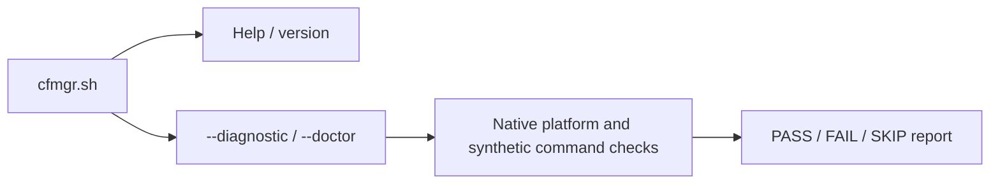

# 🧩 Architecture

[← README](../README.md) · [Development](development.md) · [Compatibility](compatibility.md) · [Implementation plan](../PLAN.md)

This is a working developer guide. It separates implemented foundations from
the intended manager; [PLAN.md](../PLAN.md) owns the detailed contracts,
acceptance checklist and implementation record. The full documentation polish
follows implementation and validation.

## 🧱 Current implementation

The repository entry point is `cfmgr.sh`; its runtime helpers live in `modules/`.
POSIX shell sources the shell helpers and invokes the awk parsers directly.
There is no generated or compiled main script. The planned installed command
remains `cfmgr`.

The development entry supports help, version and the two equivalent health
commands. It does not install CFMgr or start a feature.

| Module | Implemented responsibility | Boundary |
| --- | --- | --- |
| `cfmgr.sh` | Development command dispatch and bounded module-path resolution | No operational startup or repair |
| `modules/diagnostic.sh` | Native health report, private synthetic probes and cleanup | Entware execution and full runtime inventory remain incomplete |
| `modules/common.sh` | Decimal/range/version/SHA-256 text validation | No filesystem, service or network work |
| `modules/json.awk` | Strict bounded JSON validation and token framing | Caller must acquire stable input and validate complete output |
| `modules/ip.sh` | Strict IPv4/IPv6 host normalization | Address syntax does not establish public eligibility or current WAN state |
| `modules/mountinfo.awk` | Validate a mount snapshot and select the covering mount | Does not establish persistent volume identity, writability or live mount stability |
| `modules/io.sh` | Private bounded captures and validated mount-snapshot handoff | Internal library; retained-volume approval and command supervision remain separate |
| `modules/storageinfo.awk` | Parse native mount-ID and unambiguous blkid observations | No acquisition or volume authorization; label-bearing blkid reports cannot establish UUID identity |

The parsing modules are tested foundations, not yet a complete operational call
path. See [development checks](development.md#-run-checks) for reproducible host
validation and the separate BusyBox evidence requirement.

## 🗂️ Storage and authority

| Location | Intended responsibility |
| --- | --- |
| `/jffs/scripts/cfmgr` | Installed public entry point |
| `/jffs/addons/CFMgr.d/` | Verified manager modules, private configuration and bounded durable recovery |
| `/jffs/addons/CFMgr.d/config` | Authoritative settings, typed credentials, saved activation and module catalog |
| Private RAM workspace | Transient requests, queues, observations, captures and staging |
| Verified Entware volume | Selected packages, cloudflared binary, tunnel runtime files and optional custom logs |
| User-selected backup drive | Manual data-only archives under `CFBackup/` |

Persistent settings and recovery stay in JFFS; frequent observations and retry
state stay in RAM. Missing storage must preserve saved intent and report waiting
or incomplete work. A mount label, `/dev/sd` name, directory or executable alone
cannot establish the expected volume.

Backups contain configuration and inventoried data, including credentials; they
do not restore executable code or live process/queue/transaction state. The
current manager validates a restore and rebuilds its own integrations.

## ⚙️ Intended execution boundaries

The runtime language is BusyBox-compatible POSIX `sh`. Python, pytest and the
virtualenv are developer tools only. Shared operational prerequisites are `jq`,
`coreutils-timeout` and `coreutils-sha256sum`; scoped DNS/locking additions follow
the [compatibility policy](compatibility.md). Native recovery and health checks
must remain available when those packages cannot run.

| Boundary | Required behavior |
| --- | --- |
| Entry and hooks | Validate the action, apply guards and admit bounded work; no menu or unbounded wait from a firmware hook |
| Shared controller | Check current configuration, prerequisites, ownership and retry eligibility before starting work |
| DDNS and IP-Sync | Share current IPv4/IPv6 observations, retain independent outcomes and reconcile only configured targets |
| Cloudflared controller | Keep saved activation, binary maintenance, readiness and owned-process recovery distinct |
| Installer and updater | Verify the selected generation and complete staged artifacts before replacement; retain recoverable failures |
| Status and health | Report evidence without starting services, installing dependencies or contacting providers |

The DDNS hook is the explicit bounded-wait exception so it can report Merlin's
success/failure result. It must defer promptly during boot or missing readiness.
Only a failed or timed-out firmware DDNS attempt schedules the additional CFMgr
retry; successful completion does not schedule a forced update. Exact boot
release, overlap handling and the whole-action deadline remain implementation
gates.

Why checking a command or mount once is insufficient

An installed-package record does not prove that its executable loads, supports
the required arguments or still belongs to the expected mounted volume. A
successful parser exit does not prove its output was written completely. A
live process does not prove tunnel connectivity.

The intended controller checks the evidence appropriate to each boundary and
preserves unknown outcomes. Dependency installation, mount loss and command
supervision still need implementation and fault-path validation; the current
parsers do not establish those guarantees.

## 📦 Modules and forks

Modules remain readable source files. The shipped catalog defaults to `main`;
developers can manually select `develop` or a full commit hash in the main
configuration. Resolve a branch once, then acquire one immutable repository
snapshot with its manifest and hashes. Never combine newer per-file fallbacks
or execute catalog contents as shell code.

The **developer flag** defaults to `false`. When `true`, update/reinstall preserves
an existing catalog and normal manager update checks are suppressed. A missing
catalog may be seeded; malformed settings require repair. The detailed catalog
contract and fork examples are in the [development guide](development.md#-module-catalog-and-forks).

Normal startup and hooks do not fetch missing manager code. Installation and
repair own package acquisition; dependency checks do not authorize arbitrary
module downloads.
